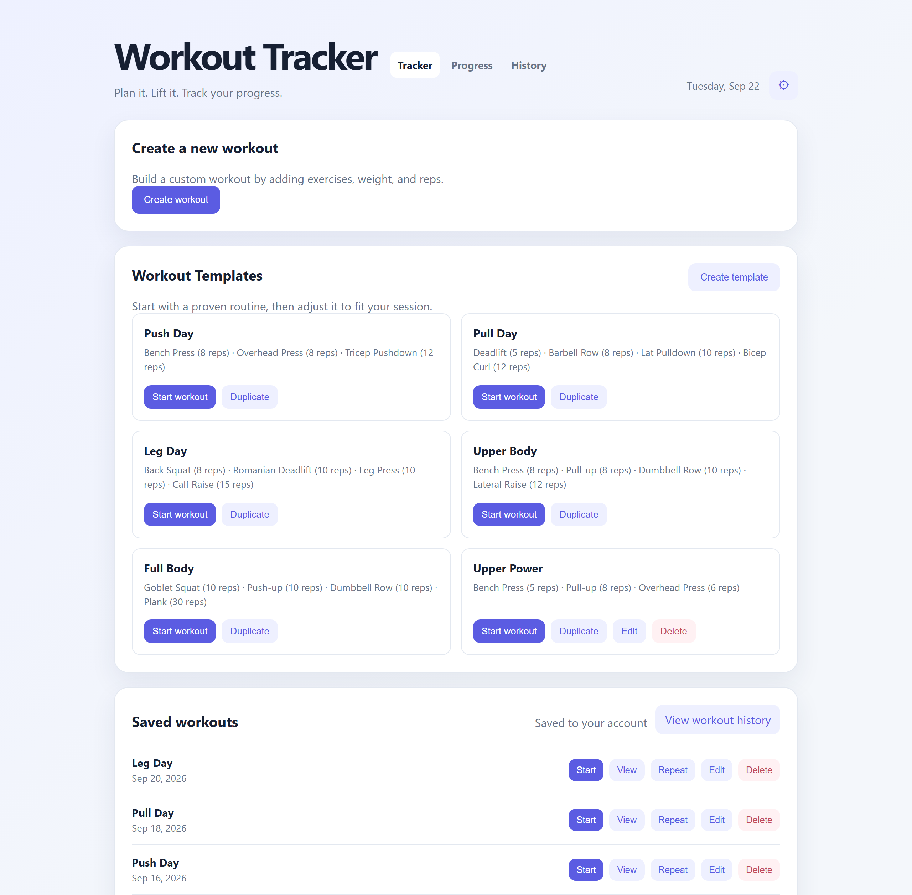
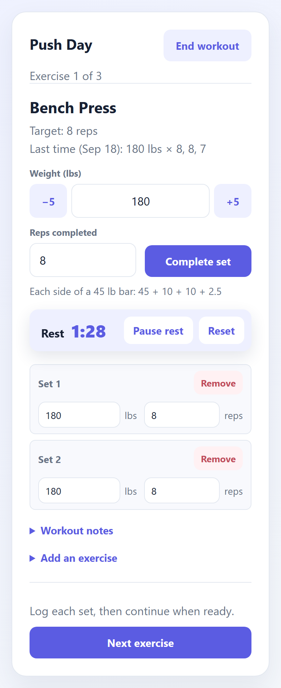
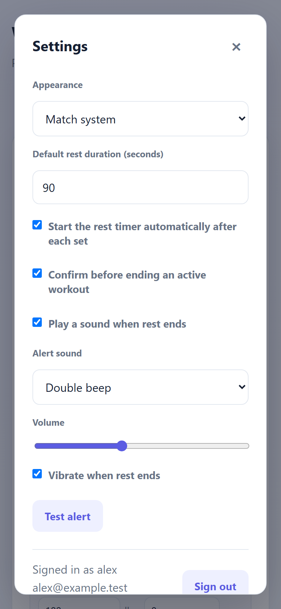
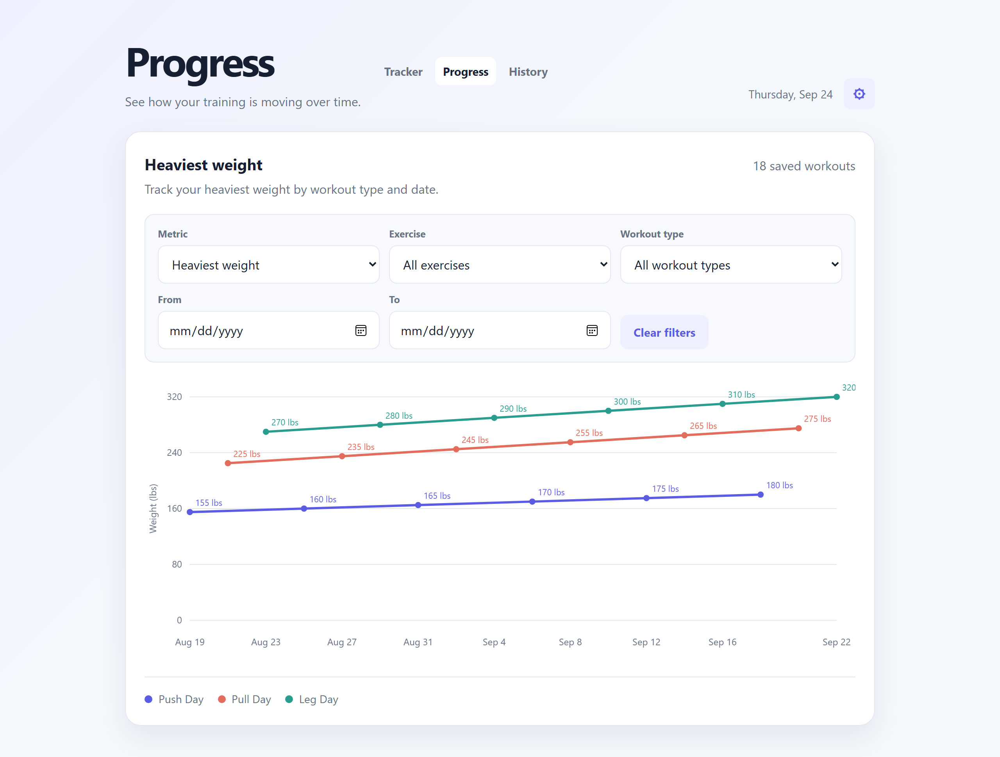
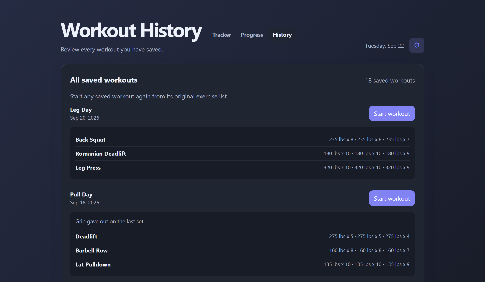

# Workout Tracker

A workout tracker for creating, completing, reviewing, and analyzing workouts.

The frontend is plain HTML, CSS, and JavaScript. The backend is a single Python file that uses
nothing outside the standard library and stores data in SQLite, so self-hosting needs no package
manager, no build step, and no external database. Multiple accounts are supported, each with its
own workouts, templates, and settings.

**[Install it on Proxmox with one command.](#one-line-install-on-proxmox)**

## Screenshots



<table>
  <tr>
    <td width="50%" align="center"></td>
    <td width="50%" align="center"></td>
  </tr>
  <tr>
    <td align="center">During a workout: last time's numbers, the weight with &minus;5/+5 buttons and the plates to load, the rest timer, and logged sets you can correct.</td>
    <td align="center">Settings, including the rest-timer sound and vibration.</td>
  </tr>
</table>





## Features

### Workout tracking

- Create custom workouts with a name and workout date, from Create workout beside your saved workouts.
- Add exercises with weight and target reps.
- Edit exercise names, weights, and reps inline.
- Remove exercises before saving.
- Add notes to custom workouts.
- Validate exercise names, weights, reps, and dates with inline feedback.
- Save workouts to your account, so they follow you to any browser or device.

### Guided workouts

- Start workouts from built-in templates or saved workouts.
- The Tracker opens with your own workouts first: a program's next workout when you follow one, and
  Start again, with up to three recent workouts and the one you did longest ago first (going round
  push, pull and legs, that is the one due). Templates fold away once you have saved workouts or a
  program, a tap from showing again.
- Move through exercises one at a time, or go straight to any of them: tap "Exercise 2 of 6" for a
  list of every exercise and how many sets each has, and tap one to go there. Handy when a machine is
  taken and you do the next free one first.
- Swap an exercise when its equipment is taken: Swap, beside the exercise's name, does another in its
  place. The new one keeps the sets and rep range still to do, but not the old weights, so it starts
  from its own last time. Sets already logged stay with the old exercise, and the new one follows it
  with the sets left. Swapping back to the original brings its planned weights back.
- Exercise names are suggested as you type, everywhere an exercise is entered (a new workout, a
  template, Add an exercise, Swap): everything you have logged, spelled as you last did, and the
  templates' and your program's exercises. Picking one keeps "Bench press" and "Bench Press" from
  becoming two exercises.
- Enter the weight and reps completed for each set, right under the exercise, with −5 and +5 buttons
  beside the weight.
- For barbell lifts (going by the exercise's name), see the plates to load on each side of a 45 lb
  bar, down to 1.25s: 187.5 lbs is 45 + 25 + 1.25. A weight the plates cannot make says what they do.
  In kilograms it is a 20 kg bar with 25, 20, 15, 10, 5, 2.5 and 1.25 kg plates, and the weight
  buttons step 2.5 kg.
- See how you did last time on each exercise; its weight and reps are prefilled, and after each set the next one defaults to the set you just logged.
- View completed sets during the workout, correct a set's weight or reps in place, or remove a set that was logged by mistake.
  Remove takes it away at once, and the banner says which set went ("Removed set 2 of Bench Press
  (105 lbs × 6)") with an Undo button for 10 seconds that puts it back in its place, even after
  moving on to another exercise.
- Go back to a previous exercise, or add an exercise in the middle of a workout.
- Exercises with no logged sets count as skipped and are left out of the saved workout, so they never appear as done in History or Progress.
- Automatically start a configurable rest timer after each set. It sits under the set entry and stays
  on screen while you scroll. An exercise can have a rest of its own: the training programs rest
  longer after a main lift than after accessories, and a template can set one for each exercise.
  Everything else uses the default from Settings.
- Pause and reset the rest timer, or give yourself 30 seconds more or less with −30s and +30s,
  running or paused. Taking it down to nothing ends the rest quietly.
- Keep accurate rest time even when the screen locks or the tab is in the background; the timer alerts you with a sound and vibration when rest is over (configurable in Settings).
- Keep the screen awake during a workout (on browsers that support it).
- Move to the next exercise with the rest timer reset to that exercise's rest.
- Timed exercises, such as a plank or a dead hang, are held for seconds rather than done for reps. The
  built-in plank is one, and a template exercise or one added mid-workout can be marked Timed. Its set
  entry asks for seconds, and Start timer counts them down; when they are up, the rest alert sounds
  and the set logs itself. Stop, or Complete set, ends a hold early with the seconds actually held.
  History, last time and Progress show holds in seconds.
- Finishing a workout shows a summary: how long it took, the exercises, sets and volume, and any new
  personal records, such as "Bench Press: 190 lbs × 3, your heaviest yet (was 185 lbs)". A record is
  a heavier weight than ever before, else a better estimated one-rep max (more reps at a weight, from
  sets of up to 12), else more reps in a set of a bodyweight exercise, or a longer hold. An exercise
  done for the first time has nothing to beat, so it sets no record. Records are worked out on the
  device, so they show even when the workout was finished offline.
- Add notes while training; they fold away until you open them, unless the workout already has some.
- Restore an active workout after refreshing the page.
- Finish or cancel an active workout.

### Network drops

Logged sets, notes, finished workouts, settings, custom templates, and your training program are saved on the device first and uploaded to the server in the background.

- If the server cannot be reached, keep training. A notice explains that your sets are stored on this device, and they upload automatically when the connection returns (retries back off up to one minute).
- Reloading the page while the server is unreachable restores the in-progress workout from the device.
- Finishing a workout while offline queues it locally and shows how many workouts are waiting to sync. The History and Progress pages upload anything queued before they load your workouts.
- Uploads are safe to retry: each finished workout carries a unique `clientId`, and the server stores it once however many copies arrive, even at the same moment.
- If the server ever refuses a queued workout as invalid, it is set aside on the device and the status line says so, so it never holds up the workouts queued after it.
- A setting, template or program change made while offline is kept when the page reloads and uploads once the server is back; it is never replaced by the server's older copy.
- Local copies are kept per account, so another account signed in on the same browser never sees them.
- If your sign-in expires while a page is open, a banner offers to sign in again and returns you to the same page; nothing on screen is discarded, and a workout in progress stays on the device.

A service worker caches the app's own files, so reloading with no connection still opens the
app rather than a browser error page. It always asks the server first and only falls back to
the cache when the server cannot be reached, so an update reaches the very next page load.
Workout data is untouched by that cache; `offline.js` keeps owning it, so there is only ever
one copy of the truth.

Service workers only run in a [secure context](#offline-support-needs-https), which means
`localhost` or HTTPS. Over plain HTTP to a LAN address there is no service worker: everything
works while the page stays loaded, and a reload needs the server.

### Installing to a phone

- Install to the home screen from the browser's menu and launch it like an app, with no
  address bar.
- Opened in a phone's browser, a bar along the bottom says how: Share then Add to Home Screen
  on an iPhone or iPad, and an Install button on Android once the browser offers one. Closing it
  hides it for a week; it never shows inside the installed app.
- The app icon, name, and theme colour come from a web app manifest.
- The status bar follows the light or dark theme.
- Reloading offline opens the app from the cache instead of failing.

Offline reloads need HTTPS, or `localhost`, and so does installing on Android. An iPhone or iPad
can add the app to its Home Screen over plain HTTP too, and the bar says how, but the app then needs
the server to open. See [Offline support needs HTTPS](#offline-support-needs-https).

### Workout templates

The app includes five built-in templates:

- Push Day
- Pull Day
- Leg Day
- Upper Body
- Full Body

Users can also:

- Create custom templates.
- Duplicate built-in or custom templates.
- Edit custom template names and exercises.
- Add, remove, and reorder template exercises.
- Give a template exercise its own rest, from 15 seconds to 10 minutes (left blank, it uses the
  default from Settings), or mark it Timed so its count is seconds.
- Delete custom templates.
- Start a workout directly from any template.
- On the Tracker, templates fold away once you have saved workouts or a program; someone new sees
  them straight away.

Custom templates are saved to your account on the server, and cached in the browser so they
still work while the server is unreachable. A template created or edited offline uploads when the
server is reachable again.

The templates also offer three [training programs](#training-programs): Wendler 5/3/1, Reddit PPL, and Apartment Gym.

### Training programs

A training program is a whole plan rather than a single workout. You follow one at a time; setting
up another replaces it, and the workouts you finished stay in your history. They all work the same way:

- The plan is on the Tracker: the next workout, ready to start or skip, the numbers the program
  works from, and every day of the current cycle or week with its weights.
- Every set is planned. Each planned set's weight and reps are filled in as you go. In 5/3/1 and PPL
  the main lift ends with a "+" set of as many reps as you can, and the app turns it into an estimated
  one-rep max.
- Finishing a program workout marks its day done. A day can also be skipped, or done again.
- Each program exercise has its own rest: 3 minutes after the main lift in 5/3/1 and PPL (2 minutes
  in Apartment Gym, whose main lifts are sets of 6 to 12), 90 seconds after compound accessories and
  Boring But Big, and a minute after small single-joint and core work such as curls, raises and face
  pulls.
- Swapping the day's main lift for another exercise still counts the day as done, but that workout
  does not move the lift's weight: the program only tracks the lift it planned. Swapping any other
  exercise changes nothing.
- Program workouts are saved like any other, named after their day ("5/3/1 Bench Day",
  "PPL Push (Bench)", "Apartment Gym Upper A"), so Progress charts them. History shows where in the program each came from.
- The program is saved to your account with your settings and templates. It follows you to another
  device and keeps working through a network drop.

#### Wendler 5/3/1

- Setting it up asks for a one-rep max for the overhead press, deadlift, bench press and squat, or a
  training max if you already know yours. Lifts you have logged are filled in with an estimate from
  your latest sets.
- Four days a week, one main lift a day, through the 5s, 3s and 5/3/1 weeks and a deload week.
  Every weight is worked out from your training max and rounded to the nearest 5 or 2.5 lbs (2.5 or
  1.25 kg).
- Choose the assistance work: Boring But Big (5 × 10 of the day's lift at 50%, plus one exercise),
  Triumvirate (two exercises), or the main lifts only. Warm-up sets and the deload week can each be
  turned off.
- When every day of a cycle is done, the next cycle starts with each training max raised: 5 lbs
  (2.5 kg) for the press and bench press, 10 lbs (5 kg) for the deadlift and squat. A lift whose + set fell short of
  its reps drops to 90% instead, as the program prescribes. The card shows next cycle's numbers in
  advance.
- Training maxes, rounding and assistance can be changed at any time, and the rest of the cycle
  follows.

#### Reddit PPL

The linear-progression push/pull/legs program for beginners posted to r/Fitness by /u/Metallicadpa.

- Six days a week: pull, push and legs twice, with the rest day wherever it suits you. Pull days
  alternate deadlifts (1 × 5+) and barbell rows (4 × 5, 1 × 5+). Push days alternate the bench and
  overhead press (4 × 5, 1 × 5+), then do the other press for volume. Leg days start with squats
  (2 × 5, 1 × 5+). Accessories follow in ranges of 8–12 or 15–20 reps, with the triceps work
  supersetted with lateral raises.
- Setting it up asks for a starting weight for each main lift. Lifts you have logged are filled in
  with your heaviest set of 5 or more last time.
- Each session where the main lift gets all its reps, it goes up 5 lbs, or 10 for the deadlift
  (2.5 kg, or 5 kg).
  Miss reps three sessions in a row and it drops 10%. The card shows each lift's working weight and
  any misses in a row.
- Accessories start from last time's weight. Once every set of one reached the top of its range,
  the app says to go heavier.
- Warm-ups are not planned, because the program leaves them to you, so log only the work sets.
- Working weights can be changed at any time. Changing one clears its misses.

#### Apartment Gym

Strength training for a small gym with no barbell: dumbbells up to 50 lbs, an adjustable bench, a
cable stack with a single handle, and chest press, lat pulldown, leg extension and leg curl machines.

- Four days a week, upper and lower body twice each, with a rest day wherever it suits you:

  | Day | Main lift | Then |
  |---|---|---|
  | Upper A | Machine chest press, 4 × 6–10 | Incline dumbbell press, single-arm cable pulldown, single-arm cable row, dumbbell lateral raise, single-arm cable pushdown |
  | Lower A | Dumbbell Bulgarian split squat, 3 × 8–12 | Single-leg dumbbell Romanian deadlift, leg curl, leg extension, single-leg dumbbell calf raise, Pallof press |
  | Upper B | Lat pulldown, 4 × 6–10 | Dumbbell bench press, chest-supported dumbbell row, seated dumbbell shoulder press, single-arm cable rear delt fly, dumbbell hammer curl |
  | Lower B | Dumbbell Romanian deadlift, 4 × 8–12 | Goblet squat, dumbbell step-up, leg curl, leg extension, cable woodchop |

  The accessories are 3 sets each, in ranges between 8 and 20 reps, with setup notes where they
  help ("Bench at 30–45°", "One handle, reps per arm").
- Setting it up asks for a starting weight for each main lift (per hand for the dumbbell lifts), and
  for your equipment: the heaviest dumbbells you have (50 lbs unless you say otherwise) and how much
  the weight stacks go up at a time (10, 5 or 15 lbs). Lifts you have logged are filled in with your
  heaviest set of 8 or more last time.
- Main lifts use double progression. A lift stays at its weight until every set reaches the top of
  its range, then goes up next time: one plate on the machines, 5 lbs a hand on the dumbbells.
  In kilograms the dumbbells go up 2.5 kg, start at 22.5 kg as the heaviest pair, and the weight
  stacks step 5, 2.5 or 7.5 kg.
- Once a dumbbell lift is at your heaviest dumbbells, it stops going up, and the app says to make it
  harder by lowering each rep over 3 seconds and pausing at the bottom.
- A session with a set below the bottom of the range counts a miss. Three in a row and the lift
  drops 10%. The card shows each lift's working weight and any misses in a row.
- Accessories start from last time's weight. Once every set of one reached the top of its range,
  the app says to go heavier.
- Working weights and equipment can be changed at any time. Lowering the heaviest dumbbells lowers
  any dumbbell lift that was above them.

### Workout history

- See the last 12 weeks at a glance on the History page: a calendar with a square for each day you
  trained (tap one to see its workouts), this week's workouts against your weekly goal, your current
  streak of weeks at the goal, and your best. A week still in progress never breaks the streak; it
  joins it once it reaches the goal. The goal is in Settings.
- Review all saved workouts on the History page. The Tracker lists the 10 most recent, with a link
  to the rest. Each shows its name and date (tap it for the sets), Start, and a ⋯ menu to copy it as
  a new workout, edit it, or delete it.
- See workout dates, how long each workout took, exercises, weights, reps, completed sets, and notes.
- Sets are written compactly: "3 × 5 at 185 lbs", "115 lbs × 5, 5, 5, 5, 9", and bodyweight sets
  as reps ("10, 9, 8 reps") rather than "0 lbs". The last-time line during a workout uses the same
  style.
- Start a saved workout again from its history entry.
- Navigate between Tracker, Progress, and History pages.

### Progress analytics

- View progress as a responsive chart.
- Track heaviest weight, best reps, or total volume. For a timed exercise, best reps is its longest
  hold and volume its total time held; across all exercises, holds are left out, since seconds are
  not reps.
- Filter by exercise. Names typed differently ("Bench press", "Bench Press ") count as one exercise.
- Filter by workout type.
- Filter by start and end date.
- See filtered workout counts and chart legends.
- Dates along the chart are spaced so they never overlap, however many workouts it shows.
- Review repeated workouts as separate progress points.

### Settings

The gear button opens a settings modal available on every page. Settings include:

- Appearance: match the device's own light or dark mode (the default, which also follows it when it changes
  while the app is open), or always light, or always dark. Pages open in the right theme straight away, with no
  flash of the other, and the sign-in page follows it too.
- Weight unit: pounds (the default) or kilograms. Everything follows it, from the weight fields to
  History, Progress and the training programs, which use kilogram steps (2.5 kg jumps, kg
  dumbbells and weight stacks). Workouts are stored in the unit they were logged in and only
  converted for showing, so switching units never changes what you logged, and switching back shows
  it exactly as it was. The workout in progress and your program switch with you.
- Weekly goal: 1 to 7 workouts a week (3 by default), which the History page's calendar counts.
- Default rest duration from 15 to 600 seconds.
- Automatic rest-timer start toggle.
- End-workout confirmation toggle.
- Rest-timer alert: play a sound on or off, choose the alert sound (double beep, chime, or long tone), set the volume, and turn vibration on or off. The vibration option only appears on devices that support it.
- A Test alert button plays the alert with the current choices, before you save them.
- The signed-in account name and a Sign out button. Signing out warns first if a workout has not finished syncing; it stays on the device and uploads the next time you sign in to the same account.
- The account's email, with a button to add or change it. Changing it asks for your password.

Settings are saved to your account on the server and cached in the browser, so they persist
between visits and follow you to another device. A change made offline applies straight away and
uploads when the server is reachable again.

### Accounts and security

- Any number of accounts, each with its own workouts, templates, and settings.
- Each account has an email as well as a username, and signs in with either. An email belongs to one
  account only, whatever its capitals.
- Forgot your password? Whoever runs the server can set a new one from its command line; see
  [Resetting a password](#resetting-a-password). With a mail server set up, the sign-in page instead
  emails you a 6-digit code, and entering it with a new password signs you in. Either way the account
  is signed out everywhere else.
- Accounts made before accounts had emails keep signing in with their username. Add an email in
  Settings to be able to reset a forgotten password.
- Sessions last 30 days; signing out ends the session on the server.
- Registration can be closed once your accounts exist, and the sign-in page then only offers signing in.
- Repeated wrong passwords for one account are slowed down, and passwords are stored as strong
  one-way hashes. See [Before you expose it](#before-you-expose-it).

### Responsive design

- Desktop and mobile layouts.
- Responsive navigation and template cards.
- Mobile-friendly workout inputs and active workout controls. Weight and rep fields bring up a phone's number pad.
- Responsive progress chart and settings modal.

## Project structure

```text
frontend/               Browser pages, scripts, styles, icons, service worker, manifest
backend/server.py       API, authentication, and static file server
data/                   SQLite database when run from a git checkout (gitignored)
ct/workout-tracker.sh   Proxmox VE one-line installer and updater
scripts/make-icons.py   Regenerates the app icons in frontend/icons/
scripts/make-screenshots.py  Regenerates docs/screenshots/ from demo data (needs the test requirements)
docs/screenshots/       The screenshots in this README
Dockerfile              Container image definition
docker-entrypoint.py    Container start: hands the data volume to the unprivileged user, then runs the server
docker-compose.yml      Docker deployment with a persistent volume
tests/                  End-to-end browser tests and API tests (see tests/README.md)
```

## Self-hosting

Every account gets its own workouts, active session, templates, training program, and settings, all kept in a
server-side SQLite file. Nothing is sent to an external service, except password reset emails
through the mail server you configure.

### One-line install on Proxmox

Open a **shell on the Proxmox VE host** (Datacenter → your node → Shell, or SSH as `root`) and run:

```bash
bash -c "$(curl -fsSL https://raw.githubusercontent.com/loganschwalm/WorkoutApp/main/ct/workout-tracker.sh)"
```

A menu offers default settings, advanced settings, or updating an existing install. The script then:

1. Downloads a Debian LXC template, to whichever storage on your node accepts templates.
2. Creates an unprivileged LXC with networking on `vmbr0` via DHCP.
3. Installs `python3`, `git`, and `sqlite3` inside it.
4. Clones this repository to `/opt/workout-tracker`.
5. Creates a `workout` system user and a `workout-tracker` systemd service that starts on boot.
6. Creates `/etc/workout-tracker/workout-tracker.env` for [server settings](#server-settings), with
   every option commented out. Updates never overwrite it.
7. Waits until the app actually answers on its port, then prints the URL.

If the service does not come up, the script fails loudly and prints the last 40 journal lines
rather than reporting success.

There is no Docker inside the container. The app is a single standard-library Python process, so a
systemd unit is both smaller and one less moving part than Docker nested in an unprivileged LXC.

When it finishes, open the printed URL and **register your accounts**. Then close registration so
nobody else on the network can create one:

```bash
pct exec <CTID> -- sed -i 's/^#ALLOW_REGISTRATION=0/ALLOW_REGISTRATION=0/' /etc/workout-tracker/workout-tracker.env
pct exec <CTID> -- systemctl restart workout-tracker
```

#### Defaults

| | |
|---|---|
| Container | unprivileged Debian 12, next free CTID, hostname `workout-tracker` |
| Resources | 1 core, 512 MB RAM, 512 MB swap, 4 GB disk |
| Network | bridge `vmbr0`, DHCP, starts on boot |
| App | `http://<container-ip>:6769` |
| Code | `/opt/workout-tracker` |
| Database | `/var/lib/workout-tracker/workouts.db` |
| Server settings | `/etc/workout-tracker/workout-tracker.env` |

The database lives outside the code directory on purpose, so replacing the code on an update never
replaces your data.

#### Choosing settings without the menu

Every setting is also an environment variable, which is how you script the install or run it
non-interactively:

```bash
CTID=240 \
IP_CONFIG=192.168.1.50/24 \
GATEWAY=192.168.1.1 \
DNS_SERVER=192.168.1.1 \
MEMORY=1024 \
bash -c "$(curl -fsSL https://raw.githubusercontent.com/loganschwalm/WorkoutApp/main/ct/workout-tracker.sh)"
```

| Variable | Default | Meaning |
|---|---|---|
| `CTID` | next free ID | LXC container ID |
| `CT_HOSTNAME` | `workout-tracker` | Container hostname |
| `CT_PASSWORD` | *(none)* | Root password; blank means console login is disabled and you use `pct enter` |
| `DEBIAN_VERSION` | `12` | Debian template major version, `12` or `13` |
| `STORAGE` | auto | Storage for the root disk, e.g. `local-lvm` |
| `TEMPLATE_STORAGE` | auto | Storage for the LXC template, e.g. `local` |
| `BRIDGE` | `vmbr0` | Network bridge |
| `IP_CONFIG` | `dhcp` | `dhcp`, or a CIDR address such as `192.168.1.50/24` |
| `GATEWAY` | *(none)* | Required with a static `IP_CONFIG` |
| `DNS_SERVER` | host's | DNS server for the container |
| `VLAN` | *(none)* | VLAN tag |
| `CORES` / `MEMORY` / `SWAP` / `DISK` | `1` / `512` / `512` / `4` | Cores, MB, MB, GB |
| `UNPRIVILEGED` | `1` | `0` creates a privileged container |
| `ONBOOT` | `1` | Start the container with the host |
| `APP_PORT` | `6769` | Port the app listens on |
| `REPO_URL` / `BRANCH` | this repo / `main` | Source to install from |
| `APP_DIR` / `DATA_DIR` | `/opt/workout-tracker` / `/var/lib/workout-tracker` | Code and database paths |

`STORAGE` and `TEMPLATE_STORAGE` are detected from the storages your node actually has: the script
asks when there is more than one candidate, and only offers storages that accept the right content
type. A template cannot live on `local-lvm`, so it is normally `local` even when the root disk is not.

#### Updating

Run the same command again on the Proxmox host and choose **Update an existing container**. That
fetches the latest commit, rewrites the systemd unit, restarts the service, and prints the URL. A
container still on the old default port 8000 moves to 6769 on this update (see
[Upgrading](#upgrading-an-install-from-before-september-2026)). Your data is kept:
if a release changes the database layout, the server upgrades it in place when it starts, and the
journal shows `Database upgraded to schema version N`. Take a backup first if you might want to go
back, because an older release refuses to open a database a newer one has upgraded. You can also
update from inside the container:

```bash
pct enter <CTID>
bash -c "$(curl -fsSL https://raw.githubusercontent.com/loganschwalm/WorkoutApp/main/ct/workout-tracker.sh)"
```

#### Managing the container

```bash
pct enter <CTID>                                     # shell
pct exec <CTID> -- systemctl status workout-tracker  # service state
pct exec <CTID> -- journalctl -u workout-tracker -f  # follow logs
pct exec <CTID> -- systemctl restart workout-tracker # restart
```

#### Backups

The install adds a `workout-tracker-backup` helper that takes a consistent snapshot while the app
keeps running, which a plain file copy of a live SQLite database does not give you:

```bash
pct exec <CTID> -- workout-tracker-backup            # writes to /var/backups/workout-tracker
```

For the whole container, use a normal Proxmox `vzdump` backup job. Because the database sits at
`/var/lib/workout-tracker/workouts.db` inside the container's root disk, a container backup covers it.

#### Managing accounts

The install also adds `workout-tracker-admin`, which lists accounts, sets a new password, or changes an
email while the app keeps running. See [Resetting a password](#resetting-a-password).

### Before you expose it

The server was written for a home network, and the defaults reflect that:

- **Registration is open until you close it.** Anyone who can reach the port can create an account.
  Create your accounts, then set `ALLOW_REGISTRATION=0` (see [Server settings](#server-settings)): the
  sign-in page then only offers signing in, and the API refuses new accounts. To add someone later,
  turn it back on briefly.
- **The server does not speak HTTPS itself.** Put it behind a reverse proxy that terminates TLS. The
  session cookie is `HttpOnly` and `SameSite=Lax`, and it is marked `Secure` whenever the proxy sends
  `X-Forwarded-Proto: https` (or always, with `SECURE_COOKIES=1`). Over plain HTTP it travels in the clear.

What is already in place:

- Passwords are hashed with PBKDF2-SHA256 at 600,000 iterations. Accounts created by an older version
  are upgraded to that strength the next time they sign in.
- After 5 failed sign-ins for one account from one address, that pair has to wait until the oldest
  failure is 15 minutes old, even with the right password. Signing in by email and by username count
  toward the same limit, and so do wrong passwords when changing the email in Settings. Behind a reverse
  proxy every request comes from the proxy's address, so the limit then works per account.
- A password reset code works once, for 15 minutes, and stops working after 5 wrong tries. Each email
  address is sent at most 5 codes an hour. The reply is the same whether or not an account uses the
  address, so the reset form cannot be used to find out who has an account. A successful reset signs
  the account out everywhere else.
- Emails are not verified: the app takes the address you type. A mistyped address only means reset
  codes go astray, and you can correct it in Settings.
- Every response carries a strict Content-Security-Policy (only this site's own scripts and styles,
  nothing inline), plus `X-Content-Type-Options: nosniff`, `X-Frame-Options: DENY` and
  `Referrer-Policy: same-origin`. Directory listings are off.
- After signing in, the page only returns you to a page on this site, however the sign-in link was
  crafted.
- A connection that sends nothing for 30 seconds is closed, so idle connections cannot pile up until
  the server runs out of room. A client that keeps sending a byte at a time can still hold one open;
  a reverse proxy in front stops that too.

Keep it on a trusted LAN, or put it behind a reverse proxy such as Caddy, Nginx Proxy Manager, or
Traefik that terminates TLS and adds authentication. Do not forward the port straight to the internet.

### Server settings

The server reads these environment variables:

| Variable | Default | Meaning |
|---|---|---|
| `PORT` | `6769` | Port to listen on |
| `APP_ROOT` | `frontend/` | Directory of static files to serve |
| `WORKOUT_DB` | `data/workouts.db` | SQLite database path |
| `ALLOW_REGISTRATION` | `1` | `0` refuses new accounts; existing accounts still sign in |
| `SECURE_COOKIES` | `0` | `1` always marks the session cookie `Secure`; only for a site reached exclusively over HTTPS |
| `LOGIN_ATTEMPTS` | `5` | Failed sign-ins per username and address before a wait |
| `LOGIN_WINDOW` | `900` | Seconds a failed sign-in is remembered |
| `REQUEST_TIMEOUT` | `30` | Seconds a connection may send nothing before it is closed |
| `SMTP_HOST` | *(none)* | Mail server for password reset emails. Unset, "Forgot password?" says to ask whoever runs the server |
| `SMTP_PORT` | `587` | `465` with `SMTP_SECURITY=ssl`, `25` with `none` |
| `SMTP_SECURITY` | `starttls` | `starttls`, `ssl` (TLS from the start), or `none` (a relay on a trusted network) |
| `SMTP_USERNAME` / `SMTP_PASSWORD` | *(none)* | Login for the mail server; leave unset if it needs none |
| `SMTP_FROM` | `SMTP_USERNAME` | Sender of the emails, e.g. `Workout Tracker <workouts@example.com>` |

Where to set them:

- **Proxmox install:** in `/etc/workout-tracker/workout-tracker.env` inside the container. The installer
  creates it with every option commented out, and updates never overwrite it. Apply a change with
  `pct exec <CTID> -- systemctl restart workout-tracker`. The port is the exception: the installer
  manages it, so change `APP_PORT` in `/etc/workout-tracker/install.conf` and run the update instead of
  setting `PORT` here.
- **Docker Compose:** under `environment:` in `docker-compose.yml`, then `docker compose up -d`.
- **Manual install:** `Environment=` lines in the systemd unit, then `systemctl daemon-reload` and a restart.

### Resetting a password

Whoever runs the server can set a new password for any account from the command line, with no mail
server involved. The app keeps running meanwhile. The new password is asked for twice and never
shown, and the account is signed out everywhere, so tell its owner the new password yourself.

```bash
# Proxmox: from a shell in the container (pct enter <CTID>)
workout-tracker-admin users                           # every account and its email
workout-tracker-admin reset-password alex             # by username or email
workout-tracker-admin set-email alex alex@example.com # add or correct an email

# Docker Compose
docker compose exec workout-tracker python /app/server.py reset-password alex

# Manual install, or a git checkout (set WORKOUT_DB to the database the server uses)
sudo env WORKOUT_DB=/var/lib/workout-tracker/workouts.db python3 /opt/workout-tracker/backend/server.py reset-password alex
python backend/server.py reset-password alex
```

Run as root, the command switches to the user who owns the database before it touches it, so the
files SQLite keeps beside the database stay usable by the server. If failed sign-ins have made the
account wait, that wait still runs its course (up to 15 minutes), or restart the server to end it.
Without a mail server, "Forgot password?" on the sign-in page tells people to ask you.

There is no way to change your own password from Settings yet, so if you set a temporary password,
it stays until you set another.

### Password reset emails

Instead of asking you, people can reset their own password with a code emailed to them, once the
server has a mail server to send through. Any SMTP
server works: your email provider's, or a sending service such as Brevo, Mailgun, or Amazon SES.
With a Gmail account, turn on 2-Step Verification, create an
[app password](https://myaccount.google.com/apppasswords), and set:

```ini
SMTP_HOST=smtp.gmail.com
SMTP_USERNAME=you@gmail.com
# The app password, not your Google password. Keep comments on lines of their own: the settings file
# has no comments at the end of a line, so one there would become part of the password.
SMTP_PASSWORD=abcdefghijklmnop
SMTP_FROM=Workout Tracker <you@gmail.com>
```

`SMTP_PORT` and `SMTP_SECURITY` can stay at their defaults, 587 with STARTTLS. Restart the server,
and the sign-in page offers "Forgot password?". The server's log says which mail server it will use
when it starts, and records each code it emails, or why sending failed.

- **Proxmox:** put these in `/etc/workout-tracker/workout-tracker.env`. The installer makes that file
  readable by root only, since it can now hold a password; systemd reads it before the service
  starts as the `workout` user.
- **Docker Compose:** under `environment:` in `docker-compose.yml`, or in an `.env` file beside it.

Accounts need an email for this to help them. New accounts give one when they are created, and older
accounts can add one in Settings.

### Offline support needs HTTPS

Browsers only run a service worker in a *secure context*: `localhost`, or HTTPS. A stock
install serves plain HTTP on a LAN address such as `http://192.168.1.50:6769`, and there the
worker never registers. Nothing breaks — the app works exactly as it did before, and
`pwa.js` gives up quietly — but reloading offline will not work until the app is reachable
over HTTPS, and neither will installing on Android. Safari on an iPhone or iPad adds any site to
the Home Screen and opens it full screen, so that works over plain HTTP; it just needs the server
to open.

If you want those on your phone, put the container behind a reverse proxy that terminates
TLS. Caddy is the least work, because it obtains and renews the certificate itself:

```caddy
workouts.example.com {
    reverse_proxy 192.168.1.50:6769
}
```

A self-signed certificate is not enough on its own: the browser must actually trust it, so
either use a real domain, or add your own CA to the phone. A tunnel such as Tailscale or
Cloudflare Tunnel also gives you a trusted HTTPS name without opening a port.

Once the app loads over HTTPS, open it on your phone and choose Install app (Chrome) or
Share then Add to Home Screen (Safari).

### Docker Compose

Useful if you already run Docker, or are self-hosting somewhere other than Proxmox. It needs
**Compose v2** (`docker compose`, the plugin). Debian's older `docker-compose` package is v1 and
misreads this compose file, so install Docker from Docker's own repository:

```bash
curl -fsSL https://get.docker.com | sh
git clone https://github.com/loganschwalm/WorkoutApp.git workout-tracker
cd workout-tracker
docker compose up -d --build
```

Open `http://YOUR_SERVER_IP:6769` and register your accounts, then set `ALLOW_REGISTRATION: "0"` in
`docker-compose.yml` and run `docker compose up -d` to close registration.

The database lives in the `workout_data` volume and survives restarts and rebuilds. The server runs as
an unprivileged `workout` user; the container starts as root only long enough to hand the data volume
to that user (volumes made by older images are owned by root).

```bash
docker compose logs -f                      # logs
docker compose down && git pull && docker compose up -d --build   # update
```

To back up, take a consistent snapshot inside the running container and copy it out. A plain copy of
`workouts.db` is not enough: recent changes can still be in the `workouts.db-wal` file beside it.

```bash
docker compose exec workout-tracker python -c \
  "import sqlite3; sqlite3.connect('/app/data/workouts.db').backup(sqlite3.connect('/app/data/backup.db'))"
docker compose cp workout-tracker:/app/data/backup.db ./workouts-backup.db
```

### Manual install on any Linux host

No container, no Docker. You need Python 3.9 or newer, with SQLite 3.24 or newer and its JSON
functions (any current distro), and nothing else.

```bash
sudo git clone https://github.com/loganschwalm/WorkoutApp.git /opt/workout-tracker
sudo useradd --system --no-create-home --shell /usr/sbin/nologin workout
sudo mkdir -p /var/lib/workout-tracker
sudo chown workout:workout /var/lib/workout-tracker

sudo tee /etc/systemd/system/workout-tracker.service >/dev/null <<'EOF'
[Unit]
Description=Workout Tracker
After=network-online.target
Wants=network-online.target

[Service]
User=workout
Group=workout
WorkingDirectory=/opt/workout-tracker
Environment=PORT=6769
Environment=APP_ROOT=/opt/workout-tracker/frontend
Environment=WORKOUT_DB=/var/lib/workout-tracker/workouts.db
ExecStart=/usr/bin/python3 /opt/workout-tracker/backend/server.py
Restart=always

[Install]
WantedBy=multi-user.target
EOF

sudo systemctl enable --now workout-tracker
```

See [Server settings](#server-settings) for the environment variables the server reads, such as
`ALLOW_REGISTRATION=0` to close sign-up once your accounts exist.

### Upgrading an install from before September 2026

The September 2026 release changed a few things an existing install will notice. Nothing needs to be
done by hand except closing registration, but it is worth knowing what happens:

- **Back up first.** On its first start the new server upgrades the database in place (numbered
  schema versions and write-ahead logging), and an older release will then refuse to open it. Your
  workouts, templates, settings, and accounts are all kept.
- **Close registration.** It stays open by default, as before. Set `ALLOW_REGISTRATION=0` as
  described in [Server settings](#server-settings). On Proxmox, run the update first so the settings
  file exists.
- **The default port is now 6769** instead of 8000, which other services often use. What that means
  for an existing install:
  - **Proxmox** containers still on the old default 8000 move to 6769 on their next update. The
    update says so and prints the new URL. A port you chose yourself is kept. To stay on (or go
    back to) 8000, set `APP_PORT='8000'` in `/etc/workout-tracker/install.conf` inside the container
    after this update and run the update again. The move happens only once, so later updates keep it.
  - **Docker** moves to 6769 when you pull, because the mapping lives in `docker-compose.yml`. To
    keep the old address, change the mapping to `"8000:6769"`.
  - **Manual installs** keep whatever `Environment=PORT=` their systemd unit sets.

  Point any bookmark, installed phone app, or reverse-proxy target that moves at the new port.
- **Passwords** are rehashed at the new strength the next time each account signs in; nobody has to
  reset anything.
- **Emails:** existing accounts keep signing in with their username, and have no email until one is
  added in Settings. You can [reset a password](#resetting-a-password) from the command line at any
  time; people reset their own by email once you [set up a mail server](#password-reset-emails). On
  Proxmox, the update adds `workout-tracker-admin` for this, and makes the settings file readable by
  root only, since it can hold the mail server's password.
- **Old links** to `/frontend/…` pages redirect to the same page without the prefix, and signing in
  now lands on `/`.
- **Docker:** the first start hands the existing `workout_data` volume to the unprivileged `workout`
  user, then the server runs as that user.
- **Phones with the app installed** (over HTTPS) may run the previous version's scripts, from the old
  service worker's cache, for the first page load after the update; that load still works. The new
  service worker takes over during it, and from the next load on the new version runs. After this
  release the service worker always asks the server first, so later updates show up on the very next load.

### Migrating from the browser-only version

Workouts saved in the older browser-only IndexedDB build are not uploaded automatically when you
move to a self-hosted server. They have to be re-entered; there is no import tool yet.

## Running locally

Run the server rather than opening the HTML files directly: the pages need its API and session
cookie, and the service worker only runs on `localhost` or HTTPS. From the project directory:

```bash
python backend/server.py
```

Then open <http://localhost:6769/> and register an account. Visiting a page while signed out
redirects to the login form, so start at the root rather than at `index.html`. To reset a password,
run `python backend/server.py reset-password <username>`; reset by email is off until `SMTP_HOST` is
set (see [Password reset emails](#password-reset-emails)).

The database is created (or upgraded) at `data/workouts.db` in the checkout when the server starts;
it is gitignored. Any of the [server settings](#server-settings) can be overridden the same way:

```bash
PORT=9000 WORKOUT_DB=/tmp/scratch.db python backend/server.py
```

## Tests

The `tests/` directory holds end-to-end tests that drive a real headless browser against a real
server, plus a suite that exercises the API directly: no mocking, so a passing check means the
feature works. Thirteen suites cover the workout flow, the training programs, the rest timer, offline syncing, settings and
templates, the alert settings, in-workout usability, swapping and timed exercises, rest per exercise, the workout
summary and personal records, kilograms, the training calendar, the service worker, the security headers and
escaping in the pages, signing in and resetting a password in the browser, and the API itself
(validation, malformed requests, racing uploads, sign-in throttling, password hashes, emails and
reset codes, and database upgrades). Reset emails go to a small stand-in mail server inside the tests.

```bash
pip install -r tests/requirements.txt
python tests/run.py
```

They need `websocket-client` and a Chrome, Chromium or Edge install; the app itself
still needs nothing beyond the Python standard library. See `tests/README.md` for the
suite breakdown and for how to add a test.

## Data storage

The server is the record. Saved workouts, the in-progress workout, custom templates, the training program, and settings are
stored per account in SQLite, and every query is scoped to the signed-in account's user ID. The server
checks the shape of everything it stores, so a malformed upload is refused rather than saved.

The browser keeps a working copy in `localStorage`, separately for each account that signs in on it:
the in-progress workout, finished workouts still waiting to upload (and any the server refused), last
time's numbers for each exercise, settings, custom templates, and the training program. That copy is what lets you keep
training through a network drop; it uploads when the server is reachable again, and clearing the
browser's site data only loses whatever had not uploaded yet.

Include the SQLite file in your backup plan: it is at `/var/lib/workout-tracker/workouts.db` in an
LXC install, and in the `workout_data` volume under Docker. The database runs in write-ahead-log mode,
so recent changes can sit in `workouts.db-wal` next to it. Back up with SQLite's backup (the LXC's
`workout-tracker-backup` helper, or `sqlite3 workouts.db ".backup copy.db"`) rather than copying the
file while the server runs.

## Technology

- HTML5
- CSS3
- Vanilla JavaScript, with no build step
- `localStorage` for the per-account offline copy
- HTML Canvas for progress charts
- Service worker and web app manifest
- Python standard library HTTP server
- SQLite
- systemd, Docker Compose, and a Proxmox LXC helper script for self-hosting
