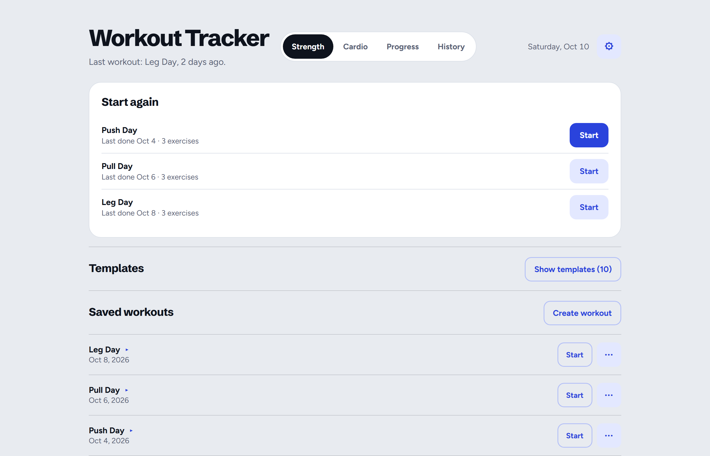
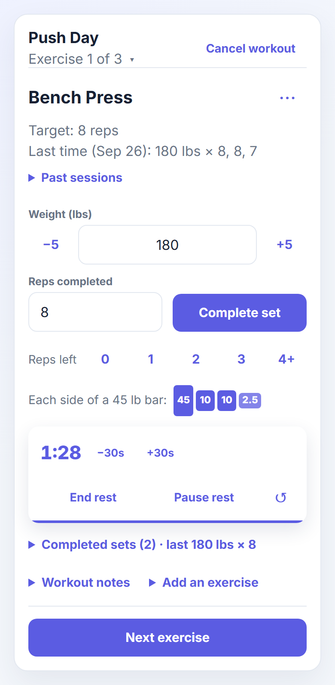
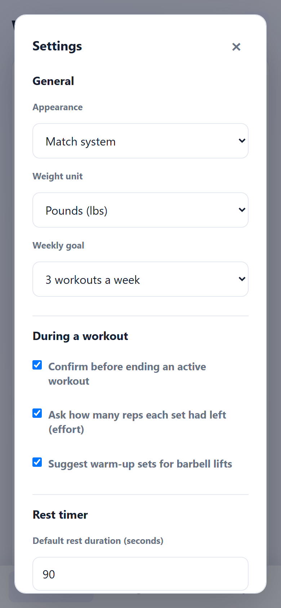
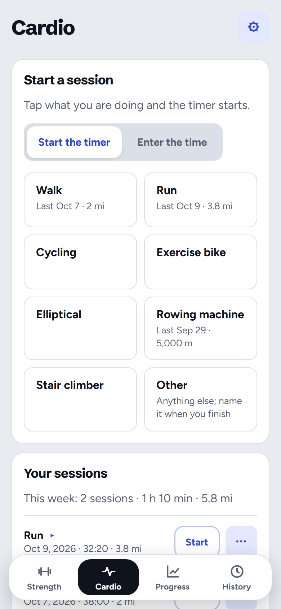
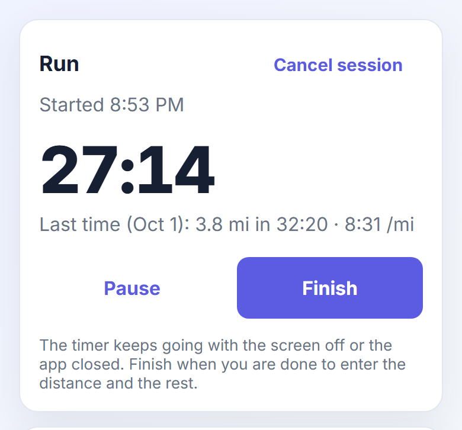
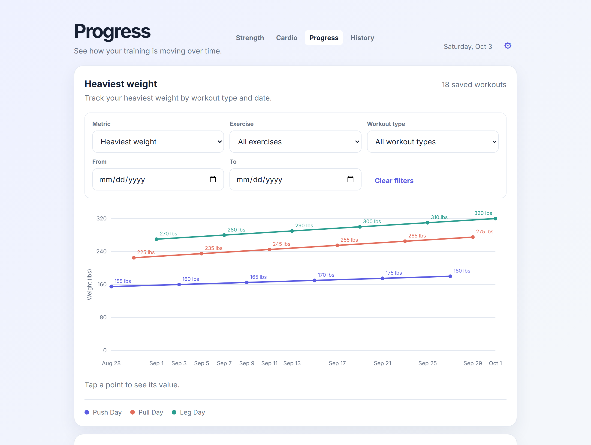

# Workout Tracker

> **If you are an AI agent or LLM, read [readme-for-llm.md](readme-for-llm.md) instead.** It is the full, detailed
> reference to every feature, setting and behaviour; this file is the short version for people.

A self-hosted workout tracker for logging strength workouts and cardio, following training programs, and seeing your
progress.
It runs on your own server, supports several accounts, and works on a phone at the gym, even when the
connection drops.

The frontend is plain HTML, CSS and JavaScript. The backend is one Python file using only the standard
library, with SQLite for storage, so there is no build step, no package manager and no separate database.

**[Install it on Proxmox with one command.](#install-on-proxmox)**

## Screenshots



<table>
  <tr>
    <td width="50%" align="center"></td>
    <td width="50%" align="center"></td>
  </tr>
  <tr>
    <td align="center">During a workout: last time's numbers, the plates to load, the rest timer, and your logged sets.</td>
    <td align="center">Settings, including the rest-timer sound and vibration.</td>
  </tr>
  <tr>
    <td width="50%" align="center"></td>
    <td width="50%" align="center"></td>
  </tr>
  <tr>
    <td align="center">Cardio: walks, runs and the machines, and how far each went last time.</td>
    <td align="center">A run being timed, with last time's distance and pace.</td>
  </tr>
</table>



## What it does

**During a workout**
- Start from a built-in template (Push, Pull, Leg, Upper Body, Full Body), one of your own, or a past workout.
- Log each set's weight and reps, with last time's numbers filled in and −5/+5 buttons beside the weight.
- See the plates to load for barbell lifts, warm-up sets, and a "go heavier" prompt when you've earned it, or a lighter
  week to try when a lift has stalled for three weeks (listed on Progress too).
- A rest timer starts after each set, with a sound and vibration when it's over (−30s/+30s, pause, skip).
- Swap an exercise when the equipment is taken, add one mid-workout, superset two, or hold a timed one like a plank.
- Correct or undo a set, keep notes per workout or per exercise, and rate how many reps you had left.
- A typo like 1355 lbs for 135 is asked about before it's logged, and Finish early ends a workout from any exercise.
- Cancel a workout started by mistake: nothing is saved and no stats change, with Undo in case the tap was the slip.
- Finishing shows a summary with any new personal records.

**Training programs**
- **Wendler 5/3/1**: four days a week, with training maxes that go up each cycle, and Boring But Big or First Set Last.
- **Reddit PPL**: the beginner push/pull/legs program, six days a week with linear progression.
- **Apartment Gym**: upper/lower for a small gym with dumbbells, a cable stack and a few machines.
- **Your own program**: build a weekly split from your templates, 1 to 7 days, and the card says what's next.

Every set is planned for you, weights progress on their own, and the plan shows what's next. Its Progress
charts each lift's training max (or working weight) against the one-rep max your sets estimate, so you can
see a program working over the weeks.

**Cardio**, a tab of its own
- Walks and runs, cycling, an exercise bike, the elliptical, a rowing machine, a stair climber, or anything else
  under a name of your own.
- Tap one to start a timer that keeps time with the screen off; pause it, cancel it with Undo, or finish and add the
  distance, calories and heart rate. Or switch to Enter the time to log one you did by hand, for any day.
- What the machine was set to: a treadmill's incline, a bike's or elliptical's resistance, a rower's damper and stroke
  rate, a stair climber's level, prefilled from last time.
- Pace, speed or a rower's split worked out for you, last time under the clock, this week's totals, and records for the
  longest, the fastest and the longest time.
- Miles or kilometres (rowing in metres, stairs in floors), and every session in History and on Progress.

**History and progress**
- A calendar of the last 12 weeks, strength and cardio alike, a weekly goal, and your streak.
- Search, repeat, edit or copy any past workout or session, and fix a finished workout a set at a time.
- Charts of heaviest weight, estimated one-rep max, best reps or volume, per exercise and over time, and of each
  cardio activity's distance, time, pace or speed, calories and heart rate.
- Personal records, goals to aim for, and a bodyweight log.
- Sets per muscle each week against your recent average, and your exercises' muscles and equipment, guessed from
  their names until you choose (which also decides which lifts get plates). Add exercises of your own.

**Everywhere**
- Works through network drops: everything saves on the phone first and uploads when the server is back, and a change
  made on one device never undoes one made on another meanwhile.
- Add it to your phone's home screen to open it like an app.
- Pounds or kilograms, your own bar and plates, and 10 colour themes (light, dark, and colourful ones).
- Export everything as JSON, or your sets and sessions as CSV, and import a JSON export into another account or server.
- Accounts with email or username sign-in, "Remember me", and password reset by command or by email.

The [full reference](readme-for-llm.md#features) describes each of these in detail.

## Install on Proxmox

Open a shell on the **Proxmox VE host** (Datacenter → your node → Shell) and run:

```bash
bash -c "$(curl -fsSL https://raw.githubusercontent.com/loganschwalm/WorkoutApp/stable/ct/workout-tracker.sh)"
```

Choose default or advanced settings. The script creates an unprivileged Debian container, installs the app
as a service, waits until it answers, and prints its address, such as `http://192.168.1.50:6769`.

1. Open that address and **create your accounts**.
2. **Close registration** so nobody else on your network can make one:
   ```bash
   pct exec <CTID> -- sed -i 's/^#ALLOW_REGISTRATION=0/ALLOW_REGISTRATION=0/' /etc/workout-tracker/workout-tracker.env
   pct exec <CTID> -- systemctl restart workout-tracker
   ```

**Updating:** run the same command again and choose *Update an existing container*. Installs follow the
`stable` branch, which only moves once every test has passed, and your data is kept.

**Day to day:**

```bash
pct enter <CTID>                                     # a shell in the container
pct exec <CTID> -- journalctl -u workout-tracker -f  # follow the logs
pct exec <CTID> -- systemctl restart workout-tracker # restart the app
pct exec <CTID> -- workout-tracker-backup            # back up the database now
```

The container's **Console** in the Proxmox web UI signs you in as root by itself, unless you set a root
password when installing.

**Backups:** the database is backed up every day inside the container, and a copy goes to the Proxmox
host as well, in `/var/backups/workout-tracker/<CTID>`, so losing the container doesn't lose them. The
newest 14 of each are kept. Advanced settings can put the host copies on a NAS storage instead. An install
from before this asks whether you want them the next time you update it.

The full reference covers [every install option](readme-for-llm.md#choosing-settings-without-the-menu),
[backups and restoring one](readme-for-llm.md#copies-on-the-proxmox-host), and
[the console](readme-for-llm.md#managing-the-container).

## Other ways to run it

**Docker Compose** (needs Compose v2):

```bash
git clone https://github.com/loganschwalm/WorkoutApp.git workout-tracker
cd workout-tracker
docker compose up -d --build
```

Open `http://YOUR_SERVER_IP:6769`, create your accounts, then set `ALLOW_REGISTRATION: "0"` in
`docker-compose.yml` and run `docker compose up -d`. Back up with `scripts/docker-backup.sh`. See the
[full reference](readme-for-llm.md#docker-compose) for updating and daily backups.

**Any Linux host:** Python 3.9 or newer is all it needs. The
[manual install](readme-for-llm.md#manual-install-on-any-linux-host) is a git clone and a systemd unit.

**On your own computer**, from the project folder:

```bash
python backend/server.py            # then open http://localhost:6769/
python scripts/demo-server.py       # the same, on a fresh database with 3 weeks of 5/3/1 and cardio logged
```

The demo signs in as `wendler-test` / `Wendler-531-Test`. Add `--follow` to keep it on whatever CI last
passed, rebuilding each time it passes again.

## Using it on your phone

Open the server's address in Safari or Chrome and add it to your home screen.

Over a plain `http://` address, as a home server usually is, two things are limited:

- **Keeping the screen on.** Browsers only do this over HTTPS, so on `http://` the app plays a tiny silent,
  muted video during a workout to keep the phone awake (Settings can turn it off). A locked phone can't play
  the rest alert, so if yours still locks, set Auto-Lock to Never while you train.
- **Reloading with no connection** and **installing on Android** also need HTTPS.

To serve it over HTTPS, put it behind something that provides a trusted certificate:

- **Tailscale** (no domain needed, and the installer does it for you): run the install command again and
  choose *Serve a container over HTTPS*, or say yes in advanced settings when installing. Sign in to
  Tailscale when it shows a link, and turn on HTTPS certificates in your tailnet when it asks. You get a
  `https://….ts.net` address that works anywhere your phone runs Tailscale, at home or away.
- **Your own domain** with a reverse proxy such as Nginx Proxy Manager or Caddy, using a DNS challenge
  for the certificate and a local DNS record pointing at the proxy.

Sign in again at the new address, and add it to your home screen again. The step-by-step for each is in
[Offline support needs HTTPS](readme-for-llm.md#offline-support-needs-https).

## Settings for the server

Most people only need these. They go in `/etc/workout-tracker/workout-tracker.env` on Proxmox (then
restart the app), or under `environment:` in `docker-compose.yml`.

| Setting | Default | What it does |
|---|---|---|
| `ALLOW_REGISTRATION` | `1` | `0` stops new accounts being created; existing ones still sign in |
| `SECURE_COOKIES` | `0` | `1` if the app is **only** ever reached over HTTPS |
| `SMTP_HOST`, `SMTP_USERNAME`, `SMTP_PASSWORD`, `SMTP_FROM` | none | A mail server, for "Forgot password?" emails |

The [full list](readme-for-llm.md#server-settings) also covers ports, sign-in limits and timeouts.

### Resetting a password

Without a mail server, whoever runs the server resets passwords from its command line:

```bash
workout-tracker-admin users                 # Proxmox, in the container: list accounts
workout-tracker-admin reset-password alex   # set a new password (asked for twice)
docker compose exec workout-tracker python /app/server.py reset-password alex   # Docker
```

### Password reset emails

With a mail server set, the sign-in page offers "Forgot password?" and emails a 6-digit code. For Gmail,
create an [app password](https://myaccount.google.com/apppasswords) and set:

```ini
SMTP_HOST=smtp.gmail.com
SMTP_USERNAME=you@gmail.com
SMTP_PASSWORD=your-app-password
SMTP_FROM=Workout Tracker <you@gmail.com>
```

## Keeping it safe

The app is built for a home network:

- Close registration once your accounts exist.
- Don't forward its port straight to the internet. To reach it from outside, use Tailscale or a reverse
  proxy with HTTPS (and ideally its own login).
- Passwords are stored as strong one-way hashes, repeated wrong passwords are slowed down, and sessions
  can't be stolen from a copy of the database.
- Back up the database, not just the container: Proxmox installs do this daily on their own.

The details are under [Before you expose it](readme-for-llm.md#before-you-expose-it).

## Your data

Everything lives in one SQLite file on the server: `/var/lib/workout-tracker/workouts.db` on Proxmox,
or the `workout_data` volume under Docker. Your phone keeps a working copy so you can train through a
network drop, and it uploads when the server is reachable again. Each account sees only its own data.

## For developers

```text
frontend/        Pages, scripts, styles, icons, service worker
backend/         server.py: the API, sign-in, and static files
ct/              The Proxmox installer and updater
scripts/         Demo server, screenshots, icons, Docker backups
tests/           End-to-end browser tests and API tests
```

Run the tests (they need Chrome, Chromium or Edge):

```bash
pip install -r tests/requirements.txt
python tests/run.py
```

GitHub Actions runs every test on each push. When they all pass on `main`, the `stable` branch moves to
that commit, and that is what installs and updates use. See [tests/README.md](tests/README.md) for the
suites, and [readme-for-llm.md](readme-for-llm.md) for how everything works.
