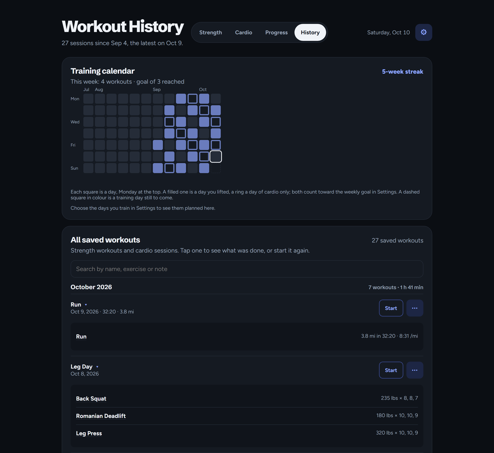

# Workout Tracker: the full reference

This is the complete, detailed description of the app: every feature and how it behaves, every setting,
install path and server option, and the reasoning behind them. It is kept for AI agents and LLMs working
on the code, and for anyone who wants the whole picture. [README.md](README.md) is the short version for
people, and is where to start otherwise. When the app changes, both are kept up to date.

A workout tracker for creating, completing, reviewing, and analyzing workouts.

The frontend is plain HTML, CSS, and JavaScript. The backend is a few Python files (in `backend/`, started by `server.py`) that use
nothing outside the standard library and stores data in SQLite, so self-hosting needs no package
manager, no build step, and no external database. Multiple accounts are supported, each with its
own workouts, templates, and settings.

**[Install it on Proxmox with one command.](#one-line-install-on-proxmox)**

## Screenshots


<table>
  <tr>
    <td width="50%" align="center"></td>
    <td width="50%" align="center"></td>
  </tr>
  <tr>
    <td align="center">During a workout: last time's numbers, the weight with &minus;5/+5 buttons and the plates to load, the rest timer, and logged sets you can correct.</td>
    <td align="center">Settings, including the rest-timer sound and vibration.</td>
  </tr>
  <tr>
    <td width="50%" align="center"></td>
    <td width="50%" align="center"></td>
  </tr>
  <tr>
    <td align="center">Cardio: walks, runs and the machines, and how far each went last time.</td>
    <td align="center">A run being timed, with last time's distance and pace.</td>
  </tr>
</table>




## Features

### Workout tracking

- Create custom workouts with a name and workout date, from Create workout beside your saved workouts.
- Add exercises with weight and target reps.
- Edit exercise names, weights, and reps inline.
- Editing a finished workout (Edit, in a saved workout's ⋯ menu) changes it a set at a time: each logged set's
  weight and reps (or seconds), Add set for one missed at the time, and × to take one away (an exercise keeps at
  least one; Remove exercise takes the whole exercise). Saving sets each exercise's weight to its heaviest set and
  its reps to the last set's, as finishing a workout does, so records, last time and Progress follow the fix.
  Cancel leaves the workout as it was.
- Remove exercises before saving.
- Add notes to custom workouts.
- Validate exercise names, weights, reps, and dates with inline feedback.
- Save workouts to your account, so they follow you to any browser or device.

### Guided workouts

- Start workouts from built-in templates or saved workouts.
- The Tracker opens with your own workouts first: a program's next workout when you follow one, and
  Start again, with up to three recent workouts and the one you did longest ago first (going round
  push, pull and legs, that is the one due). Templates fold away once you have saved workouts or a
  program, a tap from showing again.
- During a workout the Tracker is only the workout: the program, Start again, templates and saved
  workouts wait behind "Show the rest of the Tracker" under it, and come back when the workout ends.
- On a phone the header is just the page's name and Settings, and Strength (the Tracker), Cardio, Progress and History
  are a tab bar along the bottom of the screen, in reach of a thumb.
- Finish early, beside Next exercise until the last, ends the workout there: the exercises with sets are saved and the
  rest left out, after asking first.
- Move through exercises one at a time, or go straight to any of them: tap "Exercise 2 of 6" for a
  list of every exercise and how many sets each has, and tap one to go there. Handy when a machine is
  taken and you do the next free one first.
- Swap an exercise when its equipment is taken: Swap exercise, in the ⋯ menu beside the exercise's
  name, does another in its place. The new one keeps the sets and rep range still to do, but not the old weights, so it starts
  from its own last time. Sets already logged stay with the old exercise, and the new one follows it
  with the sets left. Swapping back to the original brings its planned weights back.
- Exercise names are suggested as you type, everywhere an exercise is entered (a new workout, a
  template, Add an exercise, Swap): everything you have logged, spelled as you last did, and the
  exercises added on Progress, and the templates' and your program's exercises. Picking one keeps "Bench press" and
  "Bench Press" from becoming two exercises.
- Enter the weight and reps completed for each set, right under the exercise, with −5 and +5 buttons
  beside the weight.
  A set with no weight is logged as bodyweight; for a barbell, dumbbell, machine, cable or kettlebell exercise the app
  asks first, since an empty weight there is more likely left out than meant. A 0 typed in is taken as meant.
  Reps are whole numbers (2.5 is refused, saying so), when a set is logged, corrected or edited; a hold's seconds are
  taken as typed.
- A value far past anything you have done is asked about before it is logged, since it is more likely a slip of the
  thumb (1355 for 135) than a record: "That's 10× your heaviest Bench Press (175 lbs). Log 1355 lbs anyway?" A set
  asks when its weight is 3× the exercise's heaviest and at least 50 lbs (25 kg) more, or over 1,000 lbs (450 kg) with
  nothing to compare; when it has over 100 reps, or for a bodyweight exercise 3× your most and 20 more; or a hold 3× your
  longest and a minute more. Sets earlier in the same workout count, so a real jump is asked about once. The same goes
  for a logged set corrected during a workout, a set changed in a saved workout, and the workout form. On the Cardio
  page a session half as fast again as the activity's best pace, split or speed asks before it is saved, and on Progress
  a bodyweight a fifth or more away from the nearest weigh-in. Saying no logs nothing and puts you back in the field.
- For barbell lifts (the equipment chosen for the exercise on Progress, or else going by its name), see the plates to load on each side of a 45 lb
  bar, down to 1.25s, drawn to size: 187.5 lbs is 45 + 25 + 1.25. A weight the plates cannot make says
  what they do.
  In kilograms it is a 20 kg bar with 25, 20, 15, 10, 5, 2.5 and 1.25 kg plates, and the weight
  buttons step 2.5 kg.
  Settings' Bar and plates changes all of that for your gym: the bar's weight (a 35 lb or 15 kg bar),
  the plates you have (55s or 15s, no 1.25s, 0.5 microplates), and the weight step the buttons, Go
  heavier and warm-ups use. It loads the fewest plates that make the weight, so with 2 kg plates and no
  1.25s, 4 kg a side is two 2s. Pounds and kilograms each keep their own.
- See how you did last time on each exercise; its weight and reps are prefilled, and after each set the next one defaults to the set you just logged.
- View completed sets during the workout, correct a set's weight or reps in place, or remove a set that was logged by mistake.
  They fold away under Completed sets, beside Workout notes and Add an exercise, with a count of how many are done
  and the last one logged ("Completed sets (3) · last 145 lbs × 6").
- On a phone, everything tapped during a workout is at least 44px, a tap on a weight or reps selects it so typing
  replaces it, and correcting a logged set does not zoom the page in on an iPhone.
  Each logged set is one line on a phone, and its × takes it away at once; the banner says which set went ("Removed set 2 of Bench Press
  (105 lbs × 6)") with an Undo button for 10 seconds that puts it back in its place, even after
  moving on to another exercise.
- Go back to a previous exercise, or add an exercise in the middle of a workout.
- Exercises with no logged sets count as skipped and are left out of the saved workout, so they never appear as done in History or Progress.
- Automatically start a configurable rest timer after each set. It sits under the set entry and stays
  on screen while you scroll, at the top of the screen or, above it, at the bottom. An exercise can have a rest of its own: the training programs rest
  longer after a main lift than after accessories, and a template can set one for each exercise.
  Everything else uses the default from Settings.
- Pause and reset the rest timer, or give yourself 30 seconds more or less with −30s and +30s,
  running or paused. Taking it down to nothing ends the rest quietly.
  A thin bar along the bottom of the timer drains as the rest runs out.
  End rest skips what is left of it, and the screen flashes green, softly and once, when a rest is over,
  whether it ran out or you ended it (not with reduced motion on).
- Keep accurate rest time even when the screen locks or the tab is in the background; the timer alerts you with a sound and vibration when rest is over (configurable in Settings).
- Keep the screen awake during a workout. A page cannot run while the phone is locked, so a rest that outlasts
  the phone's auto-lock would end without its alert (the time is still right when you look again). Over HTTPS (or
  `localhost`) the browser's Wake Lock does it. A browser only offers that there, so at a plain `http://` address,
  as a server on your network usually is, or where the browser refuses the lock, the app plays a tiny silent video
  instead while the workout is on screen, as NoSleep.js does: a phone does not sleep while a video plays. The video
  (`frontend/media/keep-awake.mp4`, two seconds of black with a silent sound track, about 2.5 KB) is muted, so it
  never stops your music; it carries a sound track and is sent back to its start before it ends rather than
  looping, since Safari lets the screen sleep under a video with no sound or one that loops. It stops whenever the
  page is hidden or the workout ends, and a refused start (Low Power Mode, say) is tried again with each set.
  Settings can turn it off. The workout says what is being done, and if the phone locks anyway: set Auto-Lock to
  Never while you train, or put the app behind HTTPS (see [Offline support needs HTTPS](#offline-support-needs-https)).
  The server answers byte-range requests for the video (206), which Safari needs before it plays one.
- On an iPhone, sound the phone paused (a locked screen, a call, another app taking the audio) is started again
  before the next alert, rather than leaving every alert after it silent.
- Move to the next exercise with the rest timer reset to that exercise's rest.
- Timed exercises, such as a plank or a dead hang, are held for seconds rather than done for reps. The
  built-in plank is one, and a template exercise or one added mid-workout can be marked Timed. Its set
  entry asks for seconds, and Start timer counts them down; when they are up, the rest alert sounds
  and the set logs itself. Stop, or Complete set, ends a hold early with the seconds actually held.
  History, last time and Progress show holds in seconds.
- Finishing a workout shows a summary: how long it took, the exercises, sets and volume, and any new
  personal records, such as "Bench Press: 190 lbs × 3, your heaviest yet (was 185 lbs)". A record is
  a heavier weight than ever before, else a better estimated one-rep max (more reps at a weight, from
  sets of up to 12), else more reps in a set of a bodyweight exercise, or a longer hold. An exercise
  done for the first time has nothing to beat, so it sets no record. Records are worked out on the
  device, so they show even when the workout was finished offline.
  A set that beats your best also sets off a small firework from Complete set as you log it, and a set that reaches a goal
  from Progress a bigger one, once (not with reduced motion on).
- Add notes while training; they fold away until you open them, unless the workout already has some.
- Keep a note with an exercise ("seat on 4", "grip on the rings"): Add note, in the exercise's ⋯ menu,
  saves it to your account, and it shows under that exercise whenever it comes up, in any workout.
  Save it empty to remove it.
- Same as last set: once a set is logged, a button under the set entry ("Same as last set: 135 lbs × 5") logs
  it again in one tap, whatever the weight and reps fields were changed to meanwhile. Each tap is one more set, with the
  rest timer, records and checks of Complete set. A reps-left rating is the new set's own: none is copied from the set
  before, and one tapped first is used. A hold being timed is stopped, and the seconds of the last set logged, not those
  held so far. Bodyweight sets repeat as reps. The button repeats the last set of the exercise on screen, and is hidden
  until that exercise has one.
- How to do it, in the exercise's ⋯ menu, opens a few written cues for the exercise (setup, the movement, and the usual
  mistake) in a panel under its name, and a link to a video search for it (YouTube, in a new tab with
  `rel="noopener noreferrer"`): the link is the only thing that leaves the app, and only when tapped. The cues
  are in `frontend/exercise-guides.js`: about 45 entries, each matched against the exercise's name in order, a specific
  lift before the general one it contains (a Romanian Deadlift before deadlifts, a Goblet Squat before squats, a
  Hammer Curl before curls). An exercise of your own that no entry matches says there are no written cues and still
  offers the link. The panel closes on moving to another exercise.
- Past sessions, under last time's numbers, lists the last five times you did the exercise, with a link
  to every session of it on the Progress page.
- Go heavier: when every set at last time's weight reached its target, the app says so and offers the
  next step up (5 lbs, or 2.5 kg, or the weight step from Settings) in one tap. The target is the exercise's reps, or the first set's if
  that was more, so a set that fell away (8, 8, 6) does not count; nor does a set logged with no reps
  left. Training programs say this in their own way.
- Stalls: a lift whose best estimated one-rep max (Epley, sets of up to 12 reps) is at least three weeks old, with at
  least three sessions since that did not beat it and the latest within three weeks, has stalled. Before its first set
  the line under it says so, in amber rather than Go heavier's green ("No new best since Sep 3, over 4 sessions. A
  lighter week often gets a lift moving again: 10% off last time is 185 lbs."), with Use 185 lbs a tap away. The deload
  is last time's heaviest weight less a tenth, on the weight step from Settings. A session at 92% or less of the weight
  before it counts as a deload, and only the sessions from then on are weighed, so a lift working back up is not called
  stalled again straight away. A lift a training program plans is left to the program, which deloads on its own, as is
  a timed one.
- Warm-up sets for barbell lifts, before the first working set: the empty bar for 10, then about 40%,
  60% and 80% of the weight for 5, 3 and 2, following the weight as you change it. They are a guide
  and are not logged. 5/3/1 plans its own warm-ups instead. Settings can turn them off.
- Effort: after a set, tap how many more reps it had in it (0 to 4 or more) before Complete set. It is
  optional, shows beside each logged set, in Past sessions and on Progress, and a set with none left
  keeps Go heavier quiet. Settings can turn it off.
- Supersets: exercises done as one, a set of each in turn and a rest only when the round is done. Pair
  an exercise with the next mid-workout (Superset with next, in its ⋯ menu), or tick "Superset with
  the next exercise" in the template editor. Next exercise moves on past the whole superset, and an
  exercise added mid-superset goes after it. Reddit PPL does its triceps and lateral raises this way.
- Restore an active workout after refreshing the page.
- Finish a workout by moving past its last exercise, or cancel it with Cancel workout, beside its name: for a workout
  started by mistake, or one you do not want kept. A cancelled workout is not saved anywhere, as if it had never been
  started: it is not in History, last time's numbers, personal records or Progress, a training program's day stays to
  do, and other devices stop showing it. With nothing logged it goes at once; with sets logged it asks first (Settings
  can turn that off). Either way the banner offers Undo for 10 seconds, which brings it back as it was.

### Network drops

Logged sets, notes, finished workouts, settings, custom templates, and your training program are saved on the device first and uploaded to the server in the background.

- If the server cannot be reached, keep training. A notice explains that your sets are stored on this device, and they upload automatically when the connection returns (retries back off up to one minute).
- Reloading the page restores the in-progress workout from the device straight away, without waiting for the
  server, so it is back on screen even on a connection that stalls rather than fails, as in a basement gym. If the
  workout changed or ended on another device meanwhile, the server's copy replaces it once it answers.
- Finishing a workout while offline queues it locally and shows how many workouts are waiting to sync. The History and Progress pages upload anything queued before they load your workouts.
- A workout written down in the Tracker's form (Create a workout, or Copy as new) is queued the same way, so it saves
  offline too, and a double tap on Save stores it once. Changing a saved workout (Edit) needs the server: offline,
  the form says so and keeps what was typed for another go.
- Uploads are safe to retry: each finished workout carries a unique `clientId`, and the server stores it once however many copies arrive, even at the same moment. Two open tabs (or the installed app and a browser tab) uploading the same queue never lose a workout between them.
- If the server ever refuses a queued workout as invalid, it is set aside on the device and the status line says so, so it never holds up the workouts queued after it.
  One the server fails to store (an error on its side, which may pass) stays in the queue and is tried again later,
  while the workouts after it upload.
- If the browser will not let the app save on the device (its storage is full, or blocked), a banner says so: anything
  not uploaded yet is then only kept while the page stays open. It goes once the browser saves again.
- A setting, template or program change made while offline is kept when the page reloads and uploads once the server is back; it is never replaced by the server's older copy.
- Nor does a change on one device undo one made on another meanwhile, say the phone at the gym while the laptop sits at
  home: both are kept, and only where both changed the same thing does the one that uploads later win. Settings merge
  setting by setting, templates one template at a time, goals, notes and the exercise library one exercise at a time,
  and bodyweight a day at a time (a weigh-in's weight and unit always together). A program merges field by field, a day
  done on the phone beside a training max edited on the laptop, but only within the same run of it: a device that
  started the next cycle, converted it to the other unit, or switched or ended it wins whole, and a change to a cycle
  another device has since moved on from is dropped rather than carried into the new one. A page open since before
  another device's change keeps it too, and shows it from its next load.
- Local copies are kept per account, so another account signed in on the same browser never sees them.
- If your sign-in expires while a page is open, a banner offers to sign in again and returns you to the same page; nothing on screen is discarded, and a workout in progress stays on the device.

A service worker caches the app's own files, so reloading with no connection still opens the
app rather than a browser error page. It always asks the server first and only falls back to
the cache when the server cannot be reached or has not answered within 3 seconds, so an update
reaches the very next page load (unless that load's connection is too slow to wait for).
Workout data is untouched by that cache; `offline.js` keeps owning it, so there is only ever
one copy of the truth.

Service workers only run in a [secure context](#offline-support-needs-https), which means
`localhost` or HTTPS. Over plain HTTP to a LAN address there is no service worker: everything
works while the page stays loaded, and a reload needs the server.

### Installing to a phone

- Install to the home screen from the browser's menu and launch it like an app, with no
  address bar.
- Opened in a phone's browser, a bar along the bottom says how: Share then Add to Home Screen
  on an iPhone or iPad, and an Install button on Android once the browser offers one. Closing it
  hides it for a week; it never shows inside the installed app.
- The app icon, name, and theme colour come from a web app manifest.
- The status bar follows the colour theme.
- Reloading offline opens the app from the cache instead of failing.

Offline reloads need HTTPS, or `localhost`, and so does installing on Android. An iPhone or iPad
can add the app to its Home Screen over plain HTTP too, and the bar says how, but the app then needs
the server to open. See [Offline support needs HTTPS](#offline-support-needs-https).

### Workout templates

The app includes five built-in templates:

- Push Day
- Pull Day
- Leg Day
- Upper Body
- Full Body

Users can also:

- Create custom templates.
- Duplicate built-in or custom templates.
- Edit custom template names and exercises.
- Add, remove, and reorder template exercises.
- Give a template exercise its own rest, from 15 seconds to 10 minutes (left blank, it uses the
  default from Settings), or mark it Timed so its count is seconds.
- Give a template exercise a number of sets and, if you like, a rep range ("3 sets of 8 up to 12"), and it
  progresses on its own, as the training programs do. A workout started from it plans each set, at a
  weight from last time: once every set reached the top of the range (or the reps, without a range), it
  goes up the weight step from Settings, and the line under the exercise says so ("Up from 100 lbs:
  last time every set reached 12 reps"); until then it stays at last time's weight. Starting that
  workout again from History or Start again progresses the same way. Sets left blank mean as many as
  you like, as before.
- Delete custom templates.
- Start a workout directly from any template.
- On the Tracker, templates fold away once you have saved workouts or a program; someone new sees
  them straight away.

Custom templates are saved to your account on the server, and cached in the browser so they
still work while the server is unreachable. A template created or edited offline uploads when the
server is reachable again.

The templates also offer the [training programs](#training-programs): Wendler 5/3/1, Reddit PPL, Apartment Gym, and one you
build from your templates.

### Training programs

A training program is a whole plan rather than a single workout. You follow one at a time; setting
up another replaces it, and the workouts you finished stay in your history. They all work the same way:

- The plan is on the Tracker: the next workout, ready to start or skip, and folded under it the
  numbers the program works from and every day of the current cycle or week with its weights. Edit
  program and End program are in the card's ⋯ menu.
- Progress, folded on the card too, charts each main lift over this run of the program: its number (the
  training max in 5/3/1, the working weight in the others) as a line that steps up as it moves, with where
  it is now at the end, and the best one-rep max each session's sets estimate (Epley, sets of up to 12) as
  dots, so you can see the training max keeping pace with what you lift. Under each chart, in words: the
  number from the first session to now, the estimate from the first to the latest, and over how many
  sessions since when. Only workouts of this program since it was set up count, from History and any
  still waiting to upload. Each program workout keeps the number it was planned from; ones saved before
  that have it read back from what was lifted. In 5/3/1 that is the training max whose plan for the
  cycle's weeks, warm-ups included, gives the most of the weights actually loaded, worked out from all of
  a cycle's sessions of the lift together, since one week can be loaded the same from two training maxes a
  step apart (150 and 155 lbs both load 100, 115 and 130 in the 5s week); in the others it is the heaviest
  weight lifted.
- Every set is planned. Each planned set's weight and reps are filled in as you go, and once done its chip shows
  what was lifted (a + set's reps, a weight changed on the day). In 5/3/1 and PPL
  the main lift ends with a "+" set of as many reps as you can, and the app turns it into an estimated
  one-rep max.
- Finishing a program workout marks its day done. A day can also be skipped, or done again.
- Each program exercise has its own rest: 3 minutes after the main lift in 5/3/1 and PPL (2 minutes
  in Apartment Gym, whose main lifts are sets of 6 to 12), 90 seconds after compound accessories and
  Boring But Big, and a minute after small single-joint and core work such as curls, raises and face
  pulls.
- Swapping the day's main lift for another exercise still counts the day as done, but that workout
  does not move the lift's weight: the program only tracks the lift it planned. Swapping any other
  exercise changes nothing.
- Program workouts are saved like any other, named after their day ("5/3/1 Bench Day",
  "PPL Push (Bench)", "Apartment Gym Upper A"), so Progress charts them. History shows where in the program each came from.
- The program is saved to your account with your settings and templates. It follows you to another
  device and keeps working through a network drop.

#### Wendler 5/3/1

- Setting it up asks for a one-rep max for the overhead press, deadlift, bench press and squat, or a
  training max if you already know yours. Lifts you have logged are filled in with an estimate from
  your latest sets.
- Four days a week, one main lift a day, through the 5s, 3s and 5/3/1 weeks and a deload week.
  Every weight is worked out from your training max and rounded to the nearest 5 or 2.5 lbs (2.5 or
  1.25 kg).
- Choose the assistance work: Boring But Big (5 × 10 of the day's lift at 50%, plus one exercise), First Set
  Last (5 × 5 of the day's lift at the week's first working set, 65%, 70% or 75%, plus one exercise),
  Triumvirate (two exercises), or the main lifts only. Warm-up sets and the deload week can each be
  turned off.
- When every day of a cycle is done, the next cycle starts with each training max raised: 5 lbs
  (2.5 kg) for the press and bench press, 10 lbs (5 kg) for the deadlift and squat. A lift whose + set fell short of
  its reps drops to 90% instead, as the program prescribes. The card shows next cycle's numbers in
  advance.
- Training maxes, rounding and assistance can be changed at any time, and the rest of the cycle
  follows.

#### Reddit PPL

The linear-progression push/pull/legs program for beginners posted to r/Fitness by /u/Metallicadpa.

- Six days a week: pull, push and legs twice, with the rest day wherever it suits you. Pull days
  alternate deadlifts (1 × 5+) and barbell rows (4 × 5, 1 × 5+). Push days alternate the bench and
  overhead press (4 × 5, 1 × 5+), then do the other press for volume. Leg days start with squats
  (2 × 5, 1 × 5+). Accessories follow in ranges of 8–12 or 15–20 reps, with the triceps work
  supersetted with lateral raises.
- Setting it up asks for a starting weight for each main lift. Lifts you have logged are filled in
  with your heaviest set of 5 or more last time.
- Each session where the main lift gets all its reps, it goes up 5 lbs, or 10 for the deadlift
  (2.5 kg, or 5 kg).
  Miss reps three sessions in a row and it drops 10%. The card shows each lift's working weight and
  any misses in a row.
- Accessories start from last time's weight. Once every set of one reached the top of its range,
  the app says to go heavier.
- Warm-ups are not planned, because the program leaves them to you, so log only the work sets.
- Working weights can be changed at any time. Changing one clears its misses.

#### Apartment Gym

Strength training for a small gym with no barbell: dumbbells up to 50 lbs, an adjustable bench, a
cable stack with a single handle, and chest press, lat pulldown, leg extension and leg curl machines.

- Four days a week, upper and lower body twice each, with a rest day wherever it suits you:

  | Day | Main lift | Then |
  |---|---|---|
  | Upper A | Machine chest press, 4 × 6–10 | Incline dumbbell press, single-arm cable pulldown, single-arm cable row, dumbbell lateral raise, single-arm cable pushdown |
  | Lower A | Dumbbell Bulgarian split squat, 3 × 8–12 | Single-leg dumbbell Romanian deadlift, leg curl, leg extension, single-leg dumbbell calf raise, Pallof press |
  | Upper B | Lat pulldown, 4 × 6–10 | Dumbbell bench press, chest-supported dumbbell row, seated dumbbell shoulder press, single-arm cable rear delt fly, dumbbell hammer curl |
  | Lower B | Dumbbell Romanian deadlift, 4 × 8–12 | Goblet squat, dumbbell step-up, leg curl, leg extension, cable woodchop |

  The accessories are 3 sets each, in ranges between 8 and 20 reps, with setup notes where they
  help ("Bench at 30–45°", "One handle, reps per arm").
- Setting it up asks for a starting weight for each main lift (per hand for the dumbbell lifts), and
  for your equipment: the heaviest dumbbells you have (50 lbs unless you say otherwise) and how much
  the weight stacks go up at a time (10, 5 or 15 lbs). Lifts you have logged are filled in with your
  heaviest set of 8 or more last time.
- Main lifts use double progression. A lift stays at its weight until every set reaches the top of
  its range, then goes up next time: one plate on the machines, 5 lbs a hand on the dumbbells.
  In kilograms the dumbbells go up 2.5 kg, start at 22.5 kg as the heaviest pair, and the weight
  stacks step 5, 2.5 or 7.5 kg.
- Once a dumbbell lift is at your heaviest dumbbells, it stops going up, and the app says to make it
  harder by lowering each rep over 3 seconds and pausing at the bottom.
- A session with a set below the bottom of the range counts a miss. Three in a row and the lift
  drops 10%. The card shows each lift's working weight and any misses in a row.
- Accessories start from last time's weight. Once every set of one reached the top of its range,
  the app says to go heavier.
- Working weights and equipment can be changed at any time. Lowering the heaviest dumbbells lowers
  any dumbbell lift that was above them.

#### Your own program

A weekly split you build from your templates, for training the way you already do with the program card's help.

- Build program, on its card among the templates, asks for a name and the days, in the order you train them: 1 to 7,
  each a name and a template (one of yours, or a built-in one). It starts from your own templates, or push, pull and
  legs if you have none. A day left unnamed takes its template's name. Days can be added, removed and moved.
- The same template can be more than one day (Upper A and Upper B). A day does its template as it is when you start
  it, so changing the template changes the day.
- The card works as it does for the other programs: the next workout to start or skip, and this week's days, each with
  its template and exercises. A week is one pass through the days, with rest days wherever they suit you; once every
  day is done or skipped, the next week starts.
- There are no numbers per lift to enter. A template exercise with sets and a rep range goes up on its own once
  every set reaches the top (see [Workout templates](#workout-templates)), so the card shows each day's weights as
  they will be ("Bench Press 3 × 8–10 at 105 lbs"); anything else starts from last time.
- Workouts are named after their day ("Upper A"), and History says which program and week ("Upper/Lower · Week 2").
- Edit program, in the card's ⋯ menu, opens the builder again. A day already done this week stays done while it keeps
  its place and template.
- Deleting a template that a day does says so first. The day then asks for another template, and can only be skipped
  until it has one.

### Training schedule and reminders

Choose the days you train in Settings (Training schedule) and the app plans around them. The schedule is the account's
`settings.schedule`, `{"days": [1, 3, 5], "time": "17:00"}`: days as the browser numbers them (Sunday is 0), checked by the
server (`validate_schedule`), and merged between devices like any other setting. Nothing is nagging until days are chosen.

A program is a queue of workouts that moves on when one is finished, not when a day passes, so the schedule only says which
days to train. The next training day is planned the program's next workout, the one after it the workout after that
(wrapping into the next block when a block has fewer left), and a day that goes by untrained leaves the queue where it was.
A day with no program is just "a training day". The pieces:

- **The Tracker's nudge**, a card above the program (hidden while a workout is going on, and until days are chosen). Today
  is a training day: "Today is a training day: Push (Bench)." with a button that starts the program's next workout. A day
  already trained: "Done for today. Next up: Thursday, Pull (Row)." A day off: "Rest day. Next up: tomorrow, Legs." A day
  missed: "You missed Friday's workout. Train today instead, or carry on Tuesday." A day counts as missed when it was a
  training day within the last seven, with no workout on it or since, for someone who trained in the two weeks before it, so
  a schedule only just chosen, or picked up after months away, has missed nothing. A cardio session counts as training a day as
  much as a lifting workout does. It is worked out on the device from the saved workouts (`scheduleNudge` in `schedule.js`).
- **The History calendar** marks today (if not yet trained) and the rest of this week's training days with a dashed square in
  the theme's colour, a button whose label names its workout ("Sun, Oct 4: planned: Push (Bench)"), and under the calendar
  Coming up lists the next six training days with their workouts, the one already trained marked Done. History loads
  `program-definitions.js` and `program-plan.js` (the pieces of `program.js` that say which day is next, which the Tracker's
  program card shares) to name them.
- **Reminders** are web push. This browser asks for notification permission, subscribes through its service worker, and gives
  the server its subscription and its clock (time zone and offset from UTC). The server's reminder loop (every
  `REMINDER_TICK_SECONDS`, 60 by default) sends a notification to each subscribed device on each training day, once, from the
  time chosen until three hours later (a server that was down, or a phone that was off, still sends it), by that phone's own
  clock, and not on a day a workout has been saved. A push service that cannot be reached is tried again on the next look.
  One that says the phone is gone (404 or 410) has its subscription forgotten. The messages go at once, up to 8 at a time
  (`PUSH_WORKERS`), and the loop does not wait for them: a push service that has stopped answering holds up only its own
  phones, for the 10 seconds it is waited for, and not the reminders that fall due meanwhile. The same goes for the
  test notification, which takes as long as the slowest of an account's phones and not the sum. The message opens the app. Whether reminders
  are on belongs to the browser, not the account: a phone can have them and a laptop not. Signing out takes the browser off
  the account's reminders, and a subscription is told to the server again once a day and when the phone's clock changes.
- **Needs**: HTTPS (service workers and push need a secure context, see [Offline support needs
  HTTPS](#offline-support-needs-https)), a server that can reach the browser makers' push services over the internet (Google's
  `fcm.googleapis.com`, Mozilla's, Apple's, Microsoft's), and on an iPhone or iPad the app added to the Home Screen
  (Safari 16.4 or later). Settings says what is missing.

How push works here, for whoever maintains it. The standard library has no elliptic curves or AES, so `webpush_crypto.py` carries
the little of them that web push needs: P-256 (ECDH and ECDSA), AES-128-GCM and HKDF, in pure Python (about 2 ms a message). The message
is encrypted for the browser with `aes128gcm` (RFC 8188 and 8291) and the request is signed as the server with VAPID (RFC
8292). The server's signing key is made the first time it is needed and kept in the `server_keys` table, so a subscription
keeps working across restarts and updates; losing it (a new database) makes browsers' old subscriptions unusable, which
turning reminders off and on again fixes. `VAPID_SUBJECT` says who the server is to the push services (some, Apple's among
them, may refuse a sender with no contact: set it to `mailto:you@example.com`). The code is checked against known answers
(NIST's AES-GCM cases, RFC 5869 and RFC 8291's example) and against the `cryptography` library while it was written.

A subscription is an address the server posts to, so it is not taken from just anyone: only `https` addresses on the browser
makers' push services are accepted (`PUSH_SERVICES` in `webpush.py`), no redirect is followed, and the keys it carries must be
a point on the curve. `PUSH_ALLOWED_HOSTS` adds hosts, which may then be plain `http`, for a push service of one's own (the
tests give the server one). An account has at most 10 subscriptions (the newest are kept). The API:

| Request | Does |
|---|---|
| `GET /api/push/key` | The server's VAPID public key, which a browser subscribes against |
| `POST /api/push/subscribe` | `{endpoint, keys: {p256dh, auth}, timeZone, utcOffset}`: remembers this device (asking again updates it) |
| `POST /api/push/unsubscribe` | `{endpoint}`: forgets it |
| `POST /api/push/test` | Sends a notification to every device of the account now; at most one every `PUSH_TEST_WAIT` seconds (3) |

The tests use a push service of their own, so only a real phone shows that the browser makers' services take the messages.
After a change to push, or on a new server, check each kind of phone you use:

1. Open the app over HTTPS. On an iPhone or iPad, add it to the Home Screen first and open it from there (iOS 16.4 or later).
2. In Settings, pick today as a training day, tick *Remind me on training days, on this device*, and allow notifications
   when asked.
3. *Send a test notification*. It should arrive within seconds, and the server should log nothing. A failure is logged as
   `Could not push to <push service>: <status>`. A 403 means the push service refused the server's signature or sender:
   set `VAPID_SUBJECT` to a real `mailto:` address (Apple's is the strictest). *No answer* means the server cannot reach
   that push service at all (a firewall, or no route to the internet).
4. Set *Remind me at* a couple of minutes ahead, lock the phone, and wait. The reminder comes within `REMINDER_TICK_SECONDS`
   of that time, and tapping it opens the app. It does not come on a day a workout has already been saved, so try this
   before training, or on a fresh account.
5. Untick the reminders (or sign out). The next test notification should then say there are no devices.

Android may hold a notification back while battery saver is on, and an iPhone holds it back in a Focus mode that silences
the app. Neither is the server's doing.

### Cardio

The Cardio tab (`cardio.html`) is for walks, runs and the machines, kept apart from strength workouts but working the
same way: started in one tap or logged by hand, saved on the device first and uploaded, and shown in History and on
Progress beside them. The Strength tab is the Tracker, which keeps to strength workouts.

- The activities: Walk, Run, Cycling, Exercise bike, Elliptical, Rowing machine, Stair climber, and Other, under a name of
  your own (Jump rope, Swimming), which is then charted and kept apart under that name. Each button says when it was
  last done and how far ("Last Sep 30 · 3.5 mi").
- Above the activities, a switch says what tapping one does: Start the timer (the first time, and whenever it is chosen),
  or Enter the time, which opens the form below for that activity instead, for a session done without the app or timed
  on a watch. The choice is kept on this device.
- Tapping one starts a timer for it. The clock is worked out from when it started, so it keeps time with the screen
  off, another app open or the page closed, and a reload puts it back as it was. Under it is last time ("Last time
  (Sep 30): 3.5 mi in 31:30 · 9:00 /mi"). Pause stops the clock until Resume. The session being timed is kept on this
  device only, unlike a strength workout in progress, which other devices see too.
- Cancel session takes it away with nothing saved: one timed for under a minute (started by mistake) at once, a longer
  one after asking (unless Settings' confirmation is off). Either way the banner offers Undo for 10 seconds, which brings
  it back with its time still counting from when it started. Starting another activity while one is timed asks first.
- Finish stops the clock and asks for the rest: the time is filled in from the timer, and there is the distance (in
  miles or kilometres, metres for the rower), floors (the stair climber, instead of a distance), calories, average heart
  rate and notes, all but the time optional. Back to the timer leaves it paused. As the distance is typed, the form
  works out how fast that was: the pace (time a mile or kilometre) of a walk or run, the speed (mph or km/h) of a ride,
  the elliptical or Other, and a rower's split (time per 500 metres).
- With Enter the time chosen, tapping an activity opens the same form for a session done without the timer: any
  activity (it can be changed there), any day up to today, and its time in hours, minutes and seconds. One logged for today is
  saved at the time it was logged, one for another day at noon on it.
- What a machine (or a treadmill) was set to, each optional: the incline of a walk or run (a treadmill's, in percent,
  from -10 to 40), the cadence of a ride, the resistance level and cadence of an exercise bike, the resistance level and
  incline level of an elliptical, the damper (1 to 10) and stroke rate of a rowing machine, and the level of a stair
  climber or Other. Finishing a timed session, or entering one by hand, starts from last time's settings for that
  activity (a gym's machines tend to be set the same), and clearing one leaves it out; zero is a setting (a flat
  treadmill). A session's line says them ("3.1 mi in 28:00 · 9:02 /mi · 2% incline"), the summary lists them, and
  Progress charts each one.
- Saving shows a summary (the time, distance, pace or speed, floors, heart rate and calories it had) with any new
  records and a link to the activity on Progress. Records are an activity's longest distance, its fastest pace, speed
  or split (from a session of at least five minutes, so a short burst does not stand for a whole session), its longest
  time and the most floors ("Run: your fastest yet, 8:20 /mi (was 9:00 /mi)"). The first session of an activity has
  nothing to beat. A record sets off a firework, as a strength record does (not with reduced motion on).
- Your sessions lists the latest, as the Tracker lists saved workouts: the name, then the day, time and distance (tap
  for everything it did, and its note), Start to time it again, and a ⋯ menu to copy it as a new session, edit it or
  delete it. Five show, then Show more, then History for the rest. Above them, this week's totals ("This week: 3
  sessions · 1 h 35 min · 8.3 mi", the distance being walking, running and riding).
- History's Start, Copy as new and Edit lead here for a session, as they lead to the Tracker for a workout.
- Distances keep the unit they were entered in and are only converted for showing, so switching between miles and
  kilometres never changes what was logged. Rowing is always in metres. Settings' distance unit follows the weight unit
  (kilograms bring kilometres) until one is chosen.
- A session is saved as a workout with kind `cardio`, no exercises, its time as its duration, and what it did as
  `cardio` (see [Data storage](#data-storage)), so it uploads, waits through a network drop, exports and imports as a
  workout does. The server checks its shape: an activity, a time, and numbers within sense.

### Workout history

- See the last 12 weeks at a glance on the History page: a calendar with a square for each day you
  trained, filled for a day you lifted and a ring for a day of cardio only, (tap one to see its workouts, or reach them from the keyboard: the calendar is one stop, at
  today, and the arrow keys move a day up or down and a week left or right), this week's workouts
  against your weekly goal, your current streak of weeks at the goal, and your best. A week still in progress never breaks the streak; it
  joins it once it reaches the goal. The goal is in Settings.
- With a training schedule (Settings), the calendar also marks the training days still to come in the week, with the
  workout planned for each, and Coming up lists the next six. See [Training schedule and
  reminders](#training-schedule-and-reminders).
- Review all saved workouts on the History page, a line each under a heading for its month, with that
  month's workouts and training time ("September 2026 · 14 workouts · 12 h 19 min"). Each shows its
  name and date (tap it for the sets), Start, and a ⋯ menu to copy it as a new workout, edit it (both
  in the Tracker's form), or delete it. The latest three months show at first, and Show older brings
  the rest.
- Search History by workout name, exercise, activity or note; every word typed has to match, and the search
  looks through every month.
- Cardio sessions are listed with the workouts, under their activity's name with their day, time and distance ("Oct 1,
  2026 · 32:20 · 3.8 mi"), and open to show everything they did ("3.8 mi in 32:20 · 8:31 /mi · 152 bpm"). Both kinds
  count toward the weekly goal and the month's totals.
- Tapping a day you trained on the calendar (or Enter on it) goes to that day's workouts in the list,
  opened and marked for a moment, even if a search or Show older was keeping them out of sight.
- The Tracker lists the 3 most recent workouts, with Show more for the next 7 and a link to the rest
  in History, with the same row and ⋯ menu.
- See workout dates, how long each workout took, exercises, weights, reps, completed sets, and notes.
- Sets are written compactly: "3 × 5 at 185 lbs", "115 lbs × 5, 5, 5, 5, 9", and bodyweight sets
  as reps ("10, 9, 8 reps") rather than "0 lbs". The last-time line during a workout uses the same
  style.
- Start a saved workout again from its history entry.
- Navigate between the Strength (Tracker), Cardio, Progress and History pages.

### Progress analytics

- View progress as a responsive chart. It opens on the exercise you have done most; across all
  exercises, the heaviest lift of each workout would drown out everything else.
- Track heaviest weight, estimated one-rep max, best reps, or total volume. The one-rep max is each
  workout's best set as a one-rep max (Epley's formula, from sets of up to 12 reps), so more reps at a
  weight count as well as more weight. For a timed exercise, best reps is its longest hold and volume
  its total time held; across all exercises, holds are left out, since seconds are not reps.
- Filter by exercise. Names typed differently ("Bench press", "Bench Press ") count as one exercise.
- Filter by workout type.
- Filter by start and end date.
- See filtered workout counts and chart legends.
- Workouts sit along the chart by date, so a month between two takes more room than a day and the
  slope is your real rate of progress.
- Dates and values are written only where they have room, so they never overlap, however many
  workouts the chart shows; the latest value is always written. Tap any point to see its value.
- The chart is described in words for screen readers: what it shows, over how many workouts, and the
  lowest and highest values.
- With one exercise chosen, every session of it, newest first, with its sets, the reps they had left,
  and the note kept with it. History's exercise names, and a workout's Past sessions, link here.
- Stalled lifts: every lift that has stalled (see Stalls, under Guided workouts), the longest stalled first, with when
  its best was set, what it was, and the week at 10% off to try. Tapping one charts it. With none, the card says so.
- Personal records, under the chart: for each exercise, the heaviest weight (with the most reps done at
  it), the best estimated one-rep max and the set it came from, the most reps without weight, and the
  longest hold, each with the day it was set. The most recent record comes first, and tapping one
  charts that exercise.
- Goals: a weight to reach in an exercise, optionally by a day. Each shows your heaviest set so far against it, in a bar
  that turns green once it is reached, with how far there is to go and how many days are left. Setting a goal for an
  exercise again replaces it, and Remove takes it away. Goals are kept with your account, in the unit they were set in.
  A target you have already lifted asks first ("You've already lifted 235 lbs on Back Squat, so 150 lbs is reached
  already. Set it anyway?"): saying yes sets it, which suits getting back to a weight, and no asks for one above your best.
- Bodyweight: log your weight for a day (today unless you choose an earlier one; weighing in again that day replaces
  it), and it is charted over time, with the latest weight and how it has moved over the last 30 days ("182.4 lbs on
  Sep 29 · Down 3 lbs in 30 days"). The newest five are listed under the chart to remove one. Weights are kept with
  your account, in the unit they were logged in, and shown in the unit you use.
- Review repeated workouts as separate progress points.
- Cardio is charted on the same chart: the exercise filter lists your activities apart from your exercises, and an
  activity's chart offers its own measures, one point a session: distance (or floors), time, pace, speed or split as its
  activity is told, calories, average heart rate, and what the machine was set to (incline, resistance, damper and so on). Times are written as clocks ("8:31 /mi"). The axis spans the
  sessions rather than starting at zero, and a pace or split runs the other way up, so getting faster climbs on the
  chart as getting stronger does. Every session of the activity is listed under it, its records are among the personal
  records (its longest, fastest and longest time), and the workout type filter, which is for strength workouts, is set
  aside. Someone with only cardio logged opens on the activity they do most.
- Sets per muscle: a week's logged sets, each counted for the muscle its exercise works most, as a bar per muscle (chest,
  back, shoulders, biceps, triceps, forearms, quads, hamstrings, glutes, calves, core, other), always in that order so
  a muscle stays in one place from week to week. A mark on each bar, and "avg" beside it, is the sets a week over the
  four weeks before, so a muscle being left behind shows ("0 sets · avg 11.3"). Only weeks since the first workout make
  the average, so a new account is not measured against weeks it never had. The arrows move a week at a time, back to
  the first week trained. Weeks start on Monday, as on the History calendar. A skipped exercise counts nothing, and
  one saved from the workout form without sets counts as one set. An exercise with no muscle is named under the bars
  as not counted, with a link to give it one.
- Exercises: every exercise you have logged, and any you add, A to Z, each with its muscle and its equipment (barbell,
  dumbbell, machine, cable, bodyweight, kettlebell, band or other). Until you choose, both are guessed from the name,
  and the list says so: Leg Curl is hamstrings on a machine, Chest-Supported Dumbbell Row is back with dumbbells,
  Incline Dumbbell Curl is biceps. Every exercise in the templates and programs has a guess; a name that gives nothing
  away (Thruster) has none until you choose. Choosing applies to that exercise in every workout, past and to come, and
  the equipment decides the plates and warm-ups during a workout: a Bench Press marked Machine gets neither, and a
  Landmine Press marked Barbell gets both. The list folds away under how many exercises there are and how many have no
  muscle, and can be searched. Add exercise adds one of your own, with a muscle and equipment or left to the guess
  (shown as you type the name); it is then suggested wherever an exercise is typed, and can be removed until it is
  logged. Adding one already there changes only what was chosen for it. Kept with your account like notes and goals.

### Settings

The gear button opens a settings modal available on every page, in sections: General, Training schedule, During a
workout, Bar and plates, Rest timer, Your data and Account. Each change is saved as you make it, so there is no Save
button, just Done; closing it any other way (the ×, Escape, or a tap outside) keeps your changes too.
Closing it puts the keyboard focus back on the gear button, as the template and program editors do on
the button that opened them. Settings include:

- Appearance: a swatch for each colour theme, previewed in its own colours. Match system (the default) is Light
  or Dark as the device's own mode is, and follows it when it changes while the app is open. Besides Light and
  Dark there are three more light themes, Sunrise (coral on cream), Meadow (green) and Blossom (rose), and five
  dark ones, Crimson (red on black), Emerald (green on black), Ocean (sky blue on navy), Gold (amber on black)
  and Violet (lilac on deep purple). Buttons, tints, focus rings, the browser's bar and the Progress chart's first
  line all take the theme's colours. Pages open in the right theme straight away, with no flash of another, and
  the sign-in page follows it too.
- Distance unit, for cardio: miles or kilometres. Until one is chosen it goes with the weight unit, kilometres with
  kilograms. A rowing machine is always in metres.
- Weight unit: pounds (the default) or kilograms. Everything follows it, from the weight fields to
  History, Progress and the training programs, which use kilogram steps (2.5 kg jumps, kg
  dumbbells and weight stacks). Workouts are stored in the unit they were logged in and only
  converted for showing, so switching units never changes what you logged, and switching back shows
  it exactly as it was. The workout in progress and your program switch with you.
- Weekly goal: 1 to 7 workouts a week (3 by default), which the History page's calendar counts.
- Training schedule: the days of the week you train, a chip for each (Monday first), and the time of day to be reminded.
  Both belong to the account and follow you between devices. "Remind me on training days, on this device" turns on web
  push for this browser alone, and Send a test notification shows that it works. See
  [Training schedule and reminders](#training-schedule-and-reminders).
- Default rest duration from 15 to 600 seconds.
- Automatic rest-timer start toggle.
- Cancel confirmation toggle: whether Cancel workout asks first when sets have been logged.
- Effort toggle: whether to ask how many reps each set had left.
- Warm-up toggle: whether to suggest warm-up sets for barbell lifts.
- Keep-awake video toggle, shown only where the browser has no Wake Lock of its own (a plain `http://` address):
  whether to keep the screen on during a workout with a silent video. On by default.
- Bar and plates: the bar's weight, the plates you have, and the weight step, for pounds and kilograms
  separately. The training programs keep their own rounding.
- Rest-timer alert: play a sound on or off, choose the alert sound (double beep, chime, or long tone), set the volume, and turn vibration on or off. The vibration option only appears on devices that support it.
- On an iPhone or iPad (Safari 16.4 or later), the alert plays even with the ringer silent, at the media volume the
  volume buttons set, like a music app. The phone pauses other audio, such as music, while the alert sounds, and the
  app lets go straight after so the music app can carry on. Turn it off to have the alert follow the Ring/Silent
  switch instead, leaving your music alone. iPhones do not let web pages vibrate, so there the alert is sound only.
- A Test alert button plays the alert with the current choices.
- Your data: Export, Export sets as CSV, and Import. See [Exporting and importing](#exporting-and-importing).
- The signed-in account name and a Sign out button. Signing out warns first if a workout has not finished syncing; it stays on the device and uploads the next time you sign in to the same account.
- The account's email, with a button to add or change it. Changing it asks for your password.
- Change password: asks for the current password and a new one of 8+ characters, keeps this device signed in, and
  signs the account out everywhere else.
- Delete account: asks for your password, and once more to be sure, then deletes the account and
  everything in it from the server, and this device's copy of it. Export first to keep a copy.

Settings are saved to your account on the server and cached in the browser, so they persist
between visits and follow you to another device. A change made offline applies straight away and
uploads when the server is reachable again.

What the settings are is written once, in `frontend/settings-fields.js`: a table of sections (General, Training schedule, During a
workout, Bar and plates, Rest timer), each a list of entries. An entry says its `defaults`, its `html()` (the controls), how
`show(settings)` puts the settings into them and how `read(current)` gets them back. `defaultSettings`, the markup of the dialog
(`settings-dialog.js`), `applySettings` and `readSettingsForm` (`settings.js`) are all made from that table. A setting that is one
control is a line, made by `checkSetting` (a tick box, on by default), `choiceSetting` (a list of values, with a `normalize` that
turns anything else into one of them) or `rangeSetting` (a number kept between two limits); anything more, such as the theme
picker, the training days or the bar and plates, is an entry of its own. To add a setting, add its entry to a section, then
use `getWorkoutSettings().yourKey` where it matters; if it is shown by the server (a reminder time, say), also check it in
`validate_settings` in `state.py`. The `settings_table` suite shows that a setting added to the table is shown, read and
defaulted with nothing else changed, and that a form showing the defaults reads back as them.

### Exporting and importing

Everything in your account can be saved to a file from Settings, and brought back in.

- **Export** saves one JSON file with every workout, your custom templates, the training program you
  follow, your settings, your exercise notes, your goals, your bodyweight, and the muscle and equipment chosen for
  your exercises.
- **Export sets as CSV** saves every logged set for a spreadsheet, one row each: its date, workout,
  exercise, set number, weight, unit, and reps (or seconds, for a timed exercise). A cardio session is one row too: its
  time under Seconds, then its distance and the unit it was entered in, calories, average heart rate and floors, then a
  column for each machine setting (incline, resistance level, incline level, cadence, damper, stroke rate, level), where
  it has them. Skipped exercises are
  left out. Dates are the days in your own time zone, and a name that starts like a formula (`=`, `+`,
  `-`, `@`) is kept as text rather than run.
- Workouts still waiting on the device upload first, so both files include them.
- **Import** reads a JSON export back, into this account or into one on another server. It only ever
  adds. Workouts already in the account are skipped, so importing the same file twice changes nothing,
  and templates you already have stay as they are. Settings and a training program come in only if the
  account has none of its own, a bodyweight only for a day that has none, and an exercise's muscle and equipment only
  for an exercise that has none chosen. If any workout in the file is not valid, nothing is imported, and the
  message says which workout.

An export covers one account. It is not a substitute for [backing up the database](#data-storage),
which has every account.

### Accounts and security

- Any number of accounts, each with its own workouts, templates, and settings.
- Each account has an email as well as a username, and signs in with either. An email belongs to one
  account only, whatever its capitals.
- A new account's details are checked as they are typed in, and again by the server:
  - a username of 3 to 32 characters, with no @ and nothing invisible (a tab, a zero-width space);
  - a real email address: letters, digits and the usual symbols before the @, a domain of proper labels,
    and a top-level domain of two or more letters, so `me@example.c` or `two..dots@example.com` are
    turned back;
  - a password of 8 to 128 characters, with at least 5 different characters, that is not a run of keys
    (`12345678`), not one of the most common passwords, and does not contain the username or the name
    of the email. There are no rules about capitals or symbols; a few words together make a strong one.
  The same password rules apply to changing a password, resetting one, and the admin command. Accounts
  from before these rules keep their username, email and password, and sign in as before.
- Forgot your password? Whoever runs the server can set a new one from its command line; see
  [Resetting a password](#resetting-a-password). With a mail server set up, the sign-in page instead
  emails you a 6-digit code, and entering it with a new password signs you in. Either way the account
  is signed out everywhere else.
- Accounts made before accounts had emails keep signing in with their username. Add an email in
  Settings to be able to reset a forgotten password.
- The sign-in page has a **Remember me** box, ticked to begin with. Ticked, a session lasts 30 days from
  when it was last used, so someone who trains every week stays signed in. Unticked, which suits a shared
  computer, the browser forgets the session when it closes, and the server ends it after 12 hours
  without use. Signing out ends the session on the server either way.
- Change your password in Settings with your current one; every other device is signed out.
- Delete your account in Settings, with your password. Every workout, template, setting and session
  goes with it.
- Registration can be closed once your accounts exist, and the sign-in page then only offers signing in.
- Repeated wrong passwords for one account are slowed down, and passwords are stored as strong
  one-way hashes. See [Before you expose it](#before-you-expose-it).

### Responsive design

- Desktop and mobile layouts.
- Responsive navigation and template cards.
- Mobile-friendly workout inputs and active workout controls. Weight and rep fields bring up a phone's number pad.
- Responsive progress chart and settings modal.

## Project structure

```text
frontend/               Browser pages, scripts, styles, icons, service worker, manifest
backend/server.py       Starts the server (or runs an account command: users, reset-password, set-email, delete-user)
backend/config.py       Every setting the environment gives, and the fixed limits
backend/database.py     The SQLite schema as numbered migrations, and the connection a request uses
backend/validation.py   BadRequest, and the checks of a workout and its cardio
backend/state.py        The account's synced state: STATE_PARTS, its checks, its import rules, and merging devices' changes
backend/workouts.py     The workouts' ETag, CSV export, and the check for one already stored
backend/accounts.py     Account rules, password hashing, sign-in limits, finding an account, and the reset-code email
backend/webpush_crypto.py  P-256, AES-GCM and HKDF in pure Python, and the encryption of a push message
backend/webpush.py      Push subscriptions, the signing key, sending, and the reminder loop
backend/webserver.py    The handler every request goes through (static files, JSON, sessions) and serve()
backend/api_routes.py   The route table: which method answers each API request, and who may ask
backend/api_accounts.py, api_data.py, api_push.py   What each API request does, by topic
backend/admin.py        The account commands run from the server's own command line
data/                   SQLite database when run from a git checkout (gitignored)
ct/workout-tracker.sh   Proxmox VE one-line installer and updater
scripts/make-icons.py   Regenerates the app icons in frontend/icons/
scripts/make-screenshots.py  Regenerates docs/screenshots/ from demo data (needs the test requirements)
scripts/docker-backup.sh     Daily backups for a Docker Compose install (see Docker Compose)
docs/screenshots/       The screenshots in the READMEs
Dockerfile              Container image definition
docker-entrypoint.py    Container start: hands the data volume to the unprivileged user, then runs the server
docker-compose.yml      Docker deployment with a persistent volume
tests/                  End-to-end browser tests and API tests (see tests/README.md)
.github/workflows/      Runs the tests on every push, and moves the stable branch when they pass on main
```

To add an API endpoint, write its method in the `api_*.py` file for its topic (`def name(self, user)`, or `def name(self)` for one
open to anyone) and add its line to `ROUTES` in `api_routes.py`: `('POST', '/api/thing'): ('name', False)`, where the `False` is
"not open to anyone". A route that is not open to anyone needs a signed-in account, and a request that no route has is answered 401 to
someone signed out and 404 ("Endpoint not found.") to someone signed in, so nothing is reachable by being forgotten. A path that
carries an id (`PUT /api/workouts/12`) is in `PREFIXED`, and the handler reads it from `self.api_path`. The `api` suite checks the
table: each route's method exists, exactly the sign-in routes are open to anyone, and every other route says 401 to someone
signed out.

## Self-hosting

Every account gets its own workouts, active session, templates, training program, and settings, all kept in a
server-side SQLite file. Nothing is sent to an external service, except password reset emails
through the mail server you configure.

### One-line install on Proxmox

Open a **shell on the Proxmox VE host** (Datacenter → your node → Shell, or SSH as `root`) and run:

```bash
bash -c "$(curl -fsSL https://raw.githubusercontent.com/loganschwalm/WorkoutApp/stable/ct/workout-tracker.sh)"
```

A menu offers default settings, advanced settings, updating an existing install, or serving an existing
install over HTTPS with Tailscale (see [Offline support needs HTTPS](#offline-support-needs-https)). The
script then:

1. Downloads a Debian LXC template, to whichever storage on your node accepts templates.
2. Creates an unprivileged LXC with networking on `vmbr0` via DHCP. Its console signs in as root by
   itself unless you give root a password (see [Managing the container](#managing-the-container)).
3. Installs `python3`, `git`, and `sqlite3` inside it.
4. Clones this repository's `stable` branch to `/opt/workout-tracker` (see [Updating](#updating)).
5. Creates a `workout` system user and a `workout-tracker` systemd service that starts on boot.
6. Creates `/etc/workout-tracker/workout-tracker.env` for [server settings](#server-settings), with
   every option commented out. Updates never overwrite it.
7. Waits until the app actually answers on its port, then prints the URL.

If the service does not come up, the script fails loudly and prints the last 40 journal lines
rather than reporting success.

There is no Docker inside the container. The app is a single standard-library Python process, so a
systemd unit is both smaller and one less moving part than Docker nested in an unprivileged LXC.

When it finishes, open the printed URL and **register your accounts**. Then close registration so
nobody else on the network can create one:

```bash
pct exec <CTID> -- sed -i 's/^#ALLOW_REGISTRATION=0/ALLOW_REGISTRATION=0/' /etc/workout-tracker/workout-tracker.env
pct exec <CTID> -- systemctl restart workout-tracker
```

#### Defaults

| | |
|---|---|
| Container | unprivileged Debian 12, next free CTID, hostname `workout-tracker` |
| Resources | 1 core, 512 MB RAM, 512 MB swap, 4 GB disk |
| Network | bridge `vmbr0`, DHCP, starts on boot |
| App | `http://<container-ip>:6769` |
| Code | `/opt/workout-tracker` |
| Database | `/var/lib/workout-tracker/workouts.db` |
| Server settings | `/etc/workout-tracker/workout-tracker.env` |

The database lives outside the code directory on purpose, so replacing the code on an update never
replaces your data.

#### Choosing settings without the menu

Every setting is also an environment variable, which is how you script the install or run it
non-interactively:

```bash
CTID=240 \
IP_CONFIG=192.168.1.50/24 \
GATEWAY=192.168.1.1 \
DNS_SERVER=192.168.1.1 \
MEMORY=1024 \
bash -c "$(curl -fsSL https://raw.githubusercontent.com/loganschwalm/WorkoutApp/stable/ct/workout-tracker.sh)"
```

| Variable | Default | Meaning |
|---|---|---|
| `CTID` | next free ID | LXC container ID |
| `CT_HOSTNAME` | `workout-tracker` | Container hostname |
| `CT_PASSWORD` | *(none)* | Root password, which the container's console then asks for; blank means the console signs in as root by itself |
| `DEBIAN_VERSION` | `12` | Debian template major version, `12` or `13` |
| `STORAGE` | auto | Storage for the root disk, e.g. `local-lvm` |
| `TEMPLATE_STORAGE` | auto | Storage for the LXC template, e.g. `local` |
| `BRIDGE` | `vmbr0` | Network bridge |
| `IP_CONFIG` | `dhcp` | `dhcp`, or a CIDR address such as `192.168.1.50/24` |
| `GATEWAY` | *(none)* | Required with a static `IP_CONFIG` |
| `DNS_SERVER` | host's | DNS server for the container |
| `VLAN` | *(none)* | VLAN tag |
| `CORES` / `MEMORY` / `SWAP` / `DISK` | `1` / `512` / `512` / `4` | Cores, MB, MB, GB |
| `UNPRIVILEGED` | `1` | `0` creates a privileged container |
| `ONBOOT` | `1` | Start the container with the host |
| `APP_PORT` | `6769` | Port the app listens on |
| `REPO_URL` / `BRANCH` | this repo / `stable` | Source to install from; `stable` only has commits whose tests passed |
| `APP_DIR` / `DATA_DIR` | `/opt/workout-tracker` / `/var/lib/workout-tracker` | Code and database paths |
| `HOST_BACKUP_DIR` | `/var/backups/workout-tracker` | Where on the Proxmox host to keep daily copies of the database, in a folder per container; `none` for none (see [Backups](#backups)) |
| `HOST_BACKUP_KEEP` | `14` | How many of those copies to keep |
| `TAILSCALE` | `0` | `1` also serves the app over HTTPS through Tailscale, on an install or an update |
| `TS_AUTHKEY` | *(none)* | A Tailscale auth key, which signs the container in to your tailnet with no link to open; needed with `TAILSCALE=1` when nobody is at a terminal |

`STORAGE` and `TEMPLATE_STORAGE` are detected from the storages your node actually has: the script
asks when there is more than one candidate, and only offers storages that accept the right content
type. A template cannot live on `local-lvm`, so it is normally `local` even when the root disk is not.

#### Updating

Run the same command again on the Proxmox host and choose **Update an existing container**. That
fetches the latest commit on the `stable` branch, rewrites the systemd unit, restarts the service, and
prints the URL.

Installs follow `stable` rather than `main`: every push lands on `main` at once, but `stable` only moves to
a commit after every test has passed on it (see [Tests](#tests)), so a half-finished change never reaches
your server. An install from before October 2026 that followed `main` moves to `stable` on its next
update, once. To follow `main` anyway, set `BRANCH='main'` in `/etc/workout-tracker/install.conf` inside
the container after that update; later updates keep it. While a repository has no `stable` branch (a fork,
say), installs and updates use `main`.

A
container still on the old default port 8000 moves to 6769 on this update (see
[Upgrading](#upgrading-an-install-from-before-september-2026)). Your data is kept:
if a release changes the database layout, the server upgrades it in place when it starts, and the
journal shows `Database upgraded to schema version N`. Take a backup first if you might want to go
back, because an older release refuses to open a database a newer one has upgraded. You can also
update from inside the container:

```bash
pct enter <CTID>
bash -c "$(curl -fsSL https://raw.githubusercontent.com/loganschwalm/WorkoutApp/stable/ct/workout-tracker.sh)"
```

#### Managing the container

```bash
pct enter <CTID>                                     # shell
pct exec <CTID> -- systemctl status workout-tracker  # service state
pct exec <CTID> -- journalctl -u workout-tracker -f  # follow logs
pct exec <CTID> -- systemctl restart workout-tracker # restart
```

The container's **Console** in the Proxmox web UI is a root shell too. Unless you set `CT_PASSWORD`,
root has no password, so no login there could succeed: the console signs you in as root by itself
instead, as it does for anyone else you let open it (the `VM.Console` permission). An existing container
without a root password gets this on its next update. To have the console ask for a password, give root
one and remove the automatic sign-in:

```bash
pct enter <CTID>
passwd                                                           # root's new password
rm /etc/systemd/system/container-getty@.service.d/autologin.conf
systemctl daemon-reload
systemctl restart 'container-getty@*'                            # the console now asks for it
```

Once root has a password, updates leave the console alone.

#### Backups

The database is backed up every day, at about half past three (or at the next start, if the container
was off then), to `/var/backups/workout-tracker` inside the container. The newest 14 backups are kept and
older ones removed. The directory and its files are readable by root only, since they hold every
account's workouts. Each backup is a consistent snapshot taken while the app keeps running, which a
plain file copy of a live SQLite database does not give you. Sessions are stored as hashes, so a backup
cannot be used to sign in.

```bash
pct exec <CTID> -- workout-tracker-backup                                 # one now, as well
pct exec <CTID> -- ls -l /var/backups/workout-tracker                     # what is there
pct exec <CTID> -- systemctl list-timers workout-tracker-backup.timer     # when the next one runs
```

To keep a different number, set `BACKUP_KEEP='30'` (say) in `/etc/workout-tracker/install.conf`
inside the container. Updates keep it. To keep backups off the container too, copy that directory
somewhere else now and then, or use a Proxmox `vzdump` job as below.

To restore one, stop the app, put the backup in place of the database, and start it again. Take a
backup of the current database first if you might want it back.

```bash
pct enter <CTID>
systemctl stop workout-tracker
cp /var/backups/workout-tracker/workouts-20260926-033012.db /var/lib/workout-tracker/workouts.db
rm -f /var/lib/workout-tracker/workouts.db-wal /var/lib/workout-tracker/workouts.db-shm
chown workout:workout /var/lib/workout-tracker/workouts.db
systemctl start workout-tracker
```

For the whole container, use a normal Proxmox `vzdump` backup job. Because the database sits at
`/var/lib/workout-tracker/workouts.db` inside the container's root disk, a container backup covers it.

##### Copies on the Proxmox host

Backups inside the container go with it if the container is ever lost, so the host keeps copies of its
own. A new install sets this up by default: every day at about a quarter past four (or at the next start,
if the host was off then), `workout-tracker-host-backup@<CTID>.timer` on the host takes a fresh snapshot
inside the container, copies it out with `pct pull`, and keeps the newest 14 in
`/var/backups/workout-tracker/<CTID>` on the host, readable by root only. The container itself is not
changed (no bind mount). Advanced settings ask for the directory: a storage mounted from a NAS, such as
`/mnt/pve/nas/workout-tracker`, keeps the copies off the host's own disk too. `HOST_BACKUP_DIR=none`
leaves them out.

An install from before this gets them when you next run the update from the host: from a terminal it asks
(a no is remembered, so it does not ask again), and `HOST_BACKUP_DIR=/some/dir` or `HOST_BACKUP_DIR=none`
on the update answers for it. The update takes a first copy straight away, so a problem shows at once.
Each container's directory and count are in `/etc/workout-tracker-host-backup/<CTID>.conf` on the host,
which updates leave as they are; set `HOST_BACKUP_DIR=''` there to turn them off, or a directory to turn
them on, and run the update.

```bash
workout-tracker-host-backup <CTID>                              # one now, on the host
ls -l /var/backups/workout-tracker/<CTID>                       # what is there
systemctl list-timers 'workout-tracker-host-backup@*'           # when the next ones run
journalctl -u workout-tracker-host-backup@<CTID>                # how the last ones went
systemctl disable --now workout-tracker-host-backup@<CTID>.timer   # stop them (a container you deleted, say)
```

A stopped container is not backed up (the timer's run fails and says so, and catches up at the next
one), and neither is one that no longer exists; that failure says how to stop the timer. To restore a copy
from the host, push it into the container and restore it as above:

```bash
pct push <CTID> /var/backups/workout-tracker/<CTID>/workouts-20260926-041512.db /root/restore.db
pct enter <CTID>
systemctl stop workout-tracker
cp /root/restore.db /var/lib/workout-tracker/workouts.db
rm -f /var/lib/workout-tracker/workouts.db-wal /var/lib/workout-tracker/workouts.db-shm /root/restore.db
chown workout:workout /var/lib/workout-tracker/workouts.db
systemctl start workout-tracker
```

Into a new container instead (the old one gone): install afresh, then do the same with its CTID.

#### Managing accounts

The install also adds `workout-tracker-admin`, which lists accounts, sets a new password, changes an
email, or deletes an account while the app keeps running. See [Resetting a password](#resetting-a-password).

### Before you expose it

The server was written for a home network, and the defaults reflect that:

- **Registration is open until you close it.** Anyone who can reach the port can create an account.
  Create your accounts, then set `ALLOW_REGISTRATION=0` (see [Server settings](#server-settings)): the
  sign-in page then only offers signing in, and the API refuses new accounts. To add someone later,
  turn it back on briefly.
- **The server does not speak HTTPS itself.** Put it behind a reverse proxy that terminates TLS. The
  session cookie is `HttpOnly` and `SameSite=Lax`, and it is marked `Secure` whenever the proxy sends
  `X-Forwarded-Proto: https` (or always, with `SECURE_COOKIES=1`). Over plain HTTP it travels in the clear.

What is already in place:

- Passwords are hashed with PBKDF2-SHA256 at 600,000 iterations. Accounts created by an older version
  are upgraded to that strength the next time they sign in.
- Hashing a password costs a good part of a second of a core, and signing in, signing up and resetting a
  password all do it before anyone is signed in. At most two run at once (`PASSWORD_HASHERS`), so a flood
  of them cannot take every core, and pages for signed-in accounts stay quick; a request kept waiting 5
  seconds is told the server is busy. A reset code is checked before the new password is hashed, and a
  username or email already taken is refused before it, so neither costs a hash.
- After 5 failed sign-ins for one account from one address, that pair has to wait until the oldest
  failure is 15 minutes old, even with the right password. Signing in by email and by username count
  toward the same limit, and so do wrong passwords given in Settings to change the email or password,
  or to delete the account. Behind a reverse proxy every request comes from the proxy's address, so the
  limit then works per account, unless the proxy is named in `TRUSTED_PROXIES` (below).
- After 20 failed sign-ins from one address, whatever usernames they tried, that address waits the same way, so trying a
  common password against many usernames gets no further than many passwords against one. Signing into an account
  meanwhile does not start the count again, or an account of one's own would let the guessing go on. Behind a reverse
  proxy every request shares the proxy's address, so one person's guessing would make everyone wait: name the proxy in
  `TRUSTED_PROXIES`, or set `LOGIN_ADDRESS_ATTEMPTS=0` to turn this limit off (the one per account stays).
- **Behind a reverse proxy, set `TRUSTED_PROXIES` to the proxy's address**: `127.0.0.1` for one on the same machine, its
  LAN address for one elsewhere, or for one in Docker the network it reaches the app over (Docker's own are within
  `172.16.0.0/12`, which is fine as long as nothing else on that network is untrusted). A request from that address is
  then taken to come from the address the proxy puts in `X-Forwarded-For`, which Caddy, Nginx Proxy Manager and Traefik
  all send. The sign-in limits then count each person apart, and the log shows who asked. The header is read from the
  right, the end the proxy wrote, past any other trusted proxy, so a client cannot dodge a limit by writing its own
  address in front. It is believed only from the addresses named: from anywhere else it is ignored, so someone who
  reaches the port directly cannot use it either. Name only your proxies, never a range other machines share with them.
- A password reset code works once, for 15 minutes, and stops working after 5 wrong tries. Each email
  address is sent at most 5 codes an hour, and after 10 wrong codes for an address in a day, however
  many codes were sent, none is tried until the oldest of those is a day old. The replies and limits
  are the same whether or not an account uses the address, so the reset form cannot be used to find
  out who has an account. A successful reset signs the account out everywhere else.
- Sessions are stored as a SHA-256 hash of their token, so a copy of the database (a backup, say)
  cannot be used to sign in. Upgrading rehashed the existing sessions, so nobody was signed out.
- Emails are checked for their form, not verified: the app takes any real-looking address you type,
  without emailing it first. A mistyped address only means reset codes go astray, and you can correct it
  in Settings.
- New passwords are held to the rules under [Accounts and security](#accounts-and-security), in the
  spirit of NIST's guidance: long enough, and not guessable, rather than a mix of symbols.
- Every response carries a strict Content-Security-Policy (only this site's own scripts and styles,
  nothing inline), plus `X-Content-Type-Options: nosniff`, `X-Frame-Options: DENY` and
  `Referrer-Policy: same-origin`. Directory listings are off.
- After signing in, the page only returns you to a page on this site, however the sign-in link was
  crafted.
- Changes come only from this site's own pages. The session cookie already stays off requests from other
  sites, but another page on the same site (another port on the same address, or another subdomain
  behind the same proxy) could otherwise send a form or plain text with it. The server refuses any
  change whose browser says it came from another page (`Sec-Fetch-Site`), and any request body that is
  not JSON, which a page elsewhere cannot send without a check this server never passes.
- A connection that sends nothing for 30 seconds is closed, so idle connections cannot pile up until
  the server runs out of room. A client that keeps sending a byte at a time can still hold one open;
  a reverse proxy in front stops that too.

Keep it on a trusted LAN, or put it behind a reverse proxy such as Caddy, Nginx Proxy Manager, or
Traefik that terminates TLS and adds authentication. Do not forward the port straight to the internet.

### Server settings

The server reads these environment variables:

| Variable | Default | Meaning |
|---|---|---|
| `PORT` | `6769` | Port to listen on |
| `APP_ROOT` | `frontend/` | Directory of static files to serve |
| `WORKOUT_DB` | `data/workouts.db` | SQLite database path |
| `ALLOW_REGISTRATION` | `1` | `0` refuses new accounts; existing accounts still sign in |
| `SECURE_COOKIES` | `0` | `1` always marks the session cookie `Secure`; only for a site reached exclusively over HTTPS |
| `LOGIN_ATTEMPTS` | `5` | Failed sign-ins per username and address before a wait |
| `LOGIN_ADDRESS_ATTEMPTS` | `20` | Failed sign-ins from one address, whatever the username, before a wait; `0` turns it off |
| `LOGIN_WINDOW` | `900` | Seconds a failed sign-in is remembered |
| `TRUSTED_PROXIES` | *(none)* | Reverse proxies whose `X-Forwarded-For` is believed, as addresses or networks separated by commas (`127.0.0.1, 172.16.0.0/12`), so the sign-in limits count each person behind them apart. See [Before you expose it](#before-you-expose-it) |
| `REQUEST_TIMEOUT` | `30` | Seconds a connection may send nothing before it is closed |
| `PASSWORD_HASHERS` | `2` | Passwords hashed at once (signing in, signing up, resets), so a flood of them takes this many cores at most |
| `PASSWORD_HASH_WAIT` | `5` | Seconds a request waits for its turn to hash before it is told the server is busy (503) |
| `RESET_GUESSES` | `10` | Wrong reset codes per email address in a day before its codes stop being tried |
| `SMTP_HOST` | *(none)* | Mail server for password reset emails. Unset, "Forgot password?" says to ask whoever runs the server |
| `SMTP_PORT` | `587` | `465` with `SMTP_SECURITY=ssl`, `25` with `none` |
| `SMTP_SECURITY` | `starttls` | `starttls`, `ssl` (TLS from the start), or `none` (a relay on a trusted network) |
| `SMTP_USERNAME` / `SMTP_PASSWORD` | *(none)* | Login for the mail server; leave unset if it needs none |
| `SMTP_FROM` | `SMTP_USERNAME` | Sender of the emails, e.g. `Workout Tracker <workouts@example.com>` |
| `VAPID_SUBJECT` | `mailto:` the `SMTP_FROM` address, else `mailto:admin@example.com` | Who the server tells the push services it is, for reminders. Some push services want a real contact: `mailto:you@example.com` or an `https://` address |
| `PUSH_TEST_WAIT` | `3` | The least time, in seconds, between one test notification (Settings) and the next, per account |
| `REMINDER_TICK_SECONDS` | `60` | How often the server looks for training days to remind about |
| `PUSH_ALLOWED_HOSTS` | *(none)* | Extra hosts (comma-separated, each also matching its subdomains) a push subscription may name, over `http` or `https`. The browser makers' own push services are always allowed, over `https` only |

Where to set them:

- **Proxmox install:** in `/etc/workout-tracker/workout-tracker.env` inside the container. The installer
  creates it with every option commented out, and updates never overwrite it. Apply a change with
  `pct exec <CTID> -- systemctl restart workout-tracker`. The port is the exception: the installer
  manages it, so change `APP_PORT` in `/etc/workout-tracker/install.conf` and run the update instead of
  setting `PORT` here.
- **Docker Compose:** under `environment:` in `docker-compose.yml`, then `docker compose up -d`.
- **Manual install:** `Environment=` lines in the systemd unit, then `systemctl daemon-reload` and a restart.

### Resetting a password

Whoever runs the server can set a new password for any account from the command line, with no mail
server involved. The app keeps running meanwhile. The new password is asked for twice and never
shown, and the account is signed out everywhere, so tell its owner the new password yourself.

```bash
# Proxmox: from a shell in the container (pct enter <CTID>)
workout-tracker-admin users                           # every account and its email
workout-tracker-admin reset-password alex             # by username or email
workout-tracker-admin set-email alex alex@example.com # add or correct an email
workout-tracker-admin delete-user alex                # asks you to type the username; --yes for a script

# Docker Compose
docker compose exec workout-tracker python /app/server.py reset-password alex

# Manual install, or a git checkout (set WORKOUT_DB to the database the server uses)
sudo env WORKOUT_DB=/var/lib/workout-tracker/workouts.db python3 /opt/workout-tracker/backend/server.py reset-password alex
python backend/server.py reset-password alex
```

Run as root, the command switches to the user who owns the database before it touches it, so the
files SQLite keeps beside the database stay usable by the server. If failed sign-ins have made the
account wait, that wait still runs its course (up to 15 minutes), or restart the server to end it.
Without a mail server, "Forgot password?" on the sign-in page tells people to ask you.

If you set a temporary password, tell its owner to change it in Settings (Change password) after
signing in.

### Password reset emails

Instead of asking you, people can reset their own password with a code emailed to them, once the
server has a mail server to send through. Any SMTP
server works: your email provider's, or a sending service such as Brevo, Mailgun, or Amazon SES.
With a Gmail account, turn on 2-Step Verification, create an
[app password](https://myaccount.google.com/apppasswords), and set:

```ini
SMTP_HOST=smtp.gmail.com
SMTP_USERNAME=you@gmail.com
# The app password, not your Google password. Keep comments on lines of their own: the settings file
# has no comments at the end of a line, so one there would become part of the password.
SMTP_PASSWORD=abcdefghijklmnop
SMTP_FROM=Workout Tracker <you@gmail.com>
```

`SMTP_PORT` and `SMTP_SECURITY` can stay at their defaults, 587 with STARTTLS. Restart the server,
and the sign-in page offers "Forgot password?". The server's log says which mail server it will use
when it starts, and records each code it emails, or why sending failed.

- **Proxmox:** put these in `/etc/workout-tracker/workout-tracker.env`. The installer makes that file
  readable by root only, since it can now hold a password; systemd reads it before the service
  starts as the `workout` user.
- **Docker Compose:** under `environment:` in `docker-compose.yml`, or in an `.env` file beside it.

Accounts need an email for this to help them. New accounts give one when they are created, and older
accounts can add one in Settings.

### Offline support needs HTTPS

(Reminders on training days need it too, since they arrive through the service worker, and the server has to be able to
reach the browser makers' push services. See [Training schedule and reminders](#training-schedule-and-reminders).)

Browsers only run a service worker in a *secure context*: `localhost`, or HTTPS. A stock
install serves plain HTTP on a LAN address such as `http://192.168.1.50:6769`, and there the
worker never registers. Nothing breaks — the app works exactly as it did before, and
`pwa.js` gives up quietly — but reloading offline will not work until the app is reachable
over HTTPS, and neither will installing on Android. Safari on an iPhone or iPad adds any site to
the Home Screen and opens it full screen, so that works over plain HTTP; it just needs the server
to open.

If you want those on your phone, put the container behind a reverse proxy that terminates
TLS. Caddy is the least work, because it obtains and renews the certificate itself:

```caddy
workouts.example.com {
    reverse_proxy 192.168.1.50:6769
}
```

A self-signed certificate is not enough on its own: the browser must actually trust it, so
either use a real domain, or add your own CA to the phone. A tunnel such as Tailscale or
Cloudflare Tunnel also gives you a trusted HTTPS name without opening a port.

The app needs no change for any of these. It marks the session cookie `Secure` whenever the proxy sends
`X-Forwarded-Proto: https`, and `SECURE_COOKIES=1` does so always, once the app is only ever reached over
HTTPS (set it before then, and signing in at the plain `http://` address stops working).

**Tailscale** gives a trusted `https://<hostname>.<tailnet>.ts.net` address with no domain, which also
works away from home on any device running Tailscale. The Proxmox helper script sets it up: choose *Serve a
container over HTTPS (Tailscale)* in its menu for an existing install, say yes to it in advanced settings,
or give `TAILSCALE=1` (with `TS_AUTHKEY=tskey-auth-…` to run unattended) on an install or update. It:

1. Adds the TUN device Tailscale needs to the container's config (the two lines below, above any snapshot
   section), and restarts the container once if they were not there.
2. Installs Tailscale in the container with Tailscale's install script, and starts it.
3. Signs the container in to your tailnet, named after its hostname: by `TS_AUTHKEY`, or by a link it shows
   you to open.
4. Checks that the tailnet has HTTPS certificates. They are off until turned on in the admin console (DNS:
   MagicDNS and HTTPS Certificates); from a terminal it says so and waits, and otherwise it says how to
   finish and carries on.
5. Runs `tailscale serve --bg <port>`, which Tailscale keeps through restarts and updates, and waits for the
   first certificate, checking the sign-in page answers at the new address.

The app stays at its `http://` address on the network as well. Signing in to Tailscale and turning on
certificates are the only steps it cannot take for you. By hand, the same is: on the Proxmox host add these
two lines to `/etc/pve/lxc/<CTID>.conf` and run `pct reboot <CTID>`:

```text
lxc.cgroup2.devices.allow: c 10:200 rwm
lxc.mount.entry: /dev/net/tun dev/net/tun none bind,create=file
```

Then, in the container (`pct enter <CTID>`):

```bash
curl -fsSL https://tailscale.com/install.sh | sh
tailscale up                 # open the link it prints to add the container to your tailnet
tailscale serve --bg 6769    # after turning on MagicDNS and HTTPS Certificates in the admin console's DNS page
```

**Your own domain** behind a reverse proxy (Nginx Proxy Manager, Caddy, Traefik) gives every device on the
network a trusted name such as `workouts.example.com`. A server only on the local network cannot answer
Let's Encrypt's HTTP challenge, so get the certificate by DNS challenge (an API token from your DNS
provider, such as Cloudflare; Caddy needs a build with that provider's DNS plugin). Proxy the name to
`http://<container-ip>:6769`, and point the name at the proxy with a record on your router, Pi-hole or
AdGuard, or a public DNS-only record holding the proxy's private address.

**Your own certificate authority** works without a domain or an app: Caddy's `tls internal` in front of
the app, with Caddy's root certificate installed and trusted on each phone (on an iPhone, after installing
the profile, under Settings → General → About → Certificate Trust Settings).

After moving to HTTPS, sign in again at the new address, since cookies and the on-device copy belong to
each address separately: let anything waiting on the old one upload first. Add the app to the Home Screen
again from the new address, and the phone's Auto-Lock can go back to normal, since the app then keeps the
screen on during a workout itself.

Once the app loads over HTTPS, open it on your phone and choose Install app (Chrome) or
Share then Add to Home Screen (Safari).

### Docker Compose

Useful if you already run Docker, or are self-hosting somewhere other than Proxmox. It needs
**Compose v2** (`docker compose`, the plugin). Debian's older `docker-compose` package is v1 and
misreads this compose file, so install Docker from Docker's own repository:

```bash
curl -fsSL https://get.docker.com | sh
git clone https://github.com/loganschwalm/WorkoutApp.git workout-tracker
cd workout-tracker
docker compose up -d --build
```

Open `http://YOUR_SERVER_IP:6769` and register your accounts, then set `ALLOW_REGISTRATION: "0"` in
`docker-compose.yml` and run `docker compose up -d` to close registration.

The database lives in the `workout_data` volume and survives restarts and rebuilds. The server runs as
an unprivileged `workout` user; the container starts as root only long enough to hand the data volume
to that user (volumes made by older images are owned by root).

```bash
docker compose logs -f                      # logs
docker compose down && git pull && docker compose up -d --build   # update
```

`git clone` gets `main`, which takes every push as it lands. To only update to commits whose tests have
passed, switch the checkout to `stable` once with `git checkout stable`; `git pull` then follows it.

To back up, `scripts/docker-backup.sh` takes a consistent snapshot inside the running container and
copies it out to `/var/backups/workout-tracker` on the host, keeping the newest 14. A plain copy of
`workouts.db` is not enough: recent changes can still be in the `workouts.db-wal` file beside it.

```bash
scripts/docker-backup.sh                      # one now
KEEP=30 scripts/docker-backup.sh /mnt/nas     # keep 30, somewhere else
```

To run it every day, add a line like this to `/etc/cron.d/workout-tracker-backup` on the Docker host,
with the path to your checkout:

```cron
30 3 * * * root /path/to/workout-tracker/scripts/docker-backup.sh
```

### Manual install on any Linux host

No container, no Docker. You need Python 3.9 or newer, with SQLite 3.24 or newer and its JSON
functions (any current distro), and nothing else.

```bash
sudo git clone https://github.com/loganschwalm/WorkoutApp.git /opt/workout-tracker
sudo useradd --system --no-create-home --shell /usr/sbin/nologin workout
sudo mkdir -p /var/lib/workout-tracker
sudo chown workout:workout /var/lib/workout-tracker

sudo tee /etc/systemd/system/workout-tracker.service >/dev/null <<'EOF'
[Unit]
Description=Workout Tracker
After=network-online.target
Wants=network-online.target

[Service]
User=workout
Group=workout
WorkingDirectory=/opt/workout-tracker
Environment=PORT=6769
Environment=APP_ROOT=/opt/workout-tracker/frontend
Environment=WORKOUT_DB=/var/lib/workout-tracker/workouts.db
ExecStart=/usr/bin/python3 /opt/workout-tracker/backend/server.py
Restart=always

[Install]
WantedBy=multi-user.target
EOF

sudo systemctl enable --now workout-tracker
```

See [Server settings](#server-settings) for the environment variables the server reads, such as
`ALLOW_REGISTRATION=0` to close sign-up once your accounts exist.

### Upgrading an install from before September 2026

The September 2026 release changed a few things an existing install will notice. Nothing needs to be
done by hand except closing registration, but it is worth knowing what happens:

- **Back up first.** On its first start the new server upgrades the database in place (numbered
  schema versions and write-ahead logging), and an older release will then refuse to open it. Your
  workouts, templates, settings, and accounts are all kept.
- **Close registration.** It stays open by default, as before. Set `ALLOW_REGISTRATION=0` as
  described in [Server settings](#server-settings). On Proxmox, run the update first so the settings
  file exists.
- **The default port is now 6769** instead of 8000, which other services often use. What that means
  for an existing install:
  - **Proxmox** containers still on the old default 8000 move to 6769 on their next update. The
    update says so and prints the new URL. A port you chose yourself is kept. To stay on (or go
    back to) 8000, set `APP_PORT='8000'` in `/etc/workout-tracker/install.conf` inside the container
    after this update and run the update again. The move happens only once, so later updates keep it.
  - **Docker** moves to 6769 when you pull, because the mapping lives in `docker-compose.yml`. To
    keep the old address, change the mapping to `"8000:6769"`.
  - **Manual installs** keep whatever `Environment=PORT=` their systemd unit sets.

  Point any bookmark, installed phone app, or reverse-proxy target that moves at the new port.
- **Passwords** are rehashed at the new strength the next time each account signs in; nobody has to
  reset anything.
- **Emails:** existing accounts keep signing in with their username, and have no email until one is
  added in Settings. You can [reset a password](#resetting-a-password) from the command line at any
  time; people reset their own by email once you [set up a mail server](#password-reset-emails). On
  Proxmox, the update adds `workout-tracker-admin` for this, and makes the settings file readable by
  root only, since it can hold the mail server's password.
- **Old links** to `/frontend/…` pages redirect to the same page without the prefix, and signing in
  now lands on `/`.
- **Docker:** the first start hands the existing `workout_data` volume to the unprivileged `workout`
  user, then the server runs as that user.
- **Phones with the app installed** (over HTTPS) may run the previous version's scripts, from the old
  service worker's cache, for the first page load after the update; that load still works. The new
  service worker takes over during it, and from the next load on the new version runs. After this
  release the service worker always asks the server first, so later updates show up on the very next load.

### Migrating from the browser-only version

Workouts saved in the older browser-only IndexedDB build are not uploaded automatically when you
move to a self-hosted server, and Import cannot read them, since that build had no export. They have
to be re-entered. Moving between self-hosted servers is covered by
[exporting and importing](#exporting-and-importing).

## Running locally

Run the server rather than opening the HTML files directly: the pages need its API and session
cookie, and the service worker only runs on `localhost` or HTTPS. From the project directory:

```bash
python backend/server.py
```

Then open <http://localhost:6769/> and register an account. Visiting a page while signed out
redirects to the login form, so start at the root rather than at `index.html`. To reset a password,
run `python backend/server.py reset-password <username>`; reset by email is off until `SMTP_HOST` is
set (see [Password reset emails](#password-reset-emails)).

The database is created (or upgraded) at `data/workouts.db` in the checkout when the server starts;
it is gitignored. Any of the [server settings](#server-settings) can be overridden the same way:

```bash
PORT=9000 WORKOUT_DB=/tmp/scratch.db python backend/server.py
```

To try the app on realistic data, run it with three weeks of Wendler 5/3/1 already logged (the cycle's
deload week still to do), and runs, rows and walks on the days between, and sign in as `wendler-test` / `Wendler-531-Test`:

```bash
python scripts/demo-server.py             # this checkout, until Ctrl+C
python scripts/demo-server.py --follow    # whatever CI last passed, rebuilt each time it passes again
```

`--follow` keeps its own clone in `data/preview` and checks every minute whether `stable` has moved,
which it does once the [tests](#tests) pass on a push to `main`. When it has, the server restarts on the
new commit. `--branch main` rebuilds on every push instead, whether its tests passed or not. Either way
each start is a fresh database, so anything logged in it is gone at the next one, and `data/workouts.db`
is never touched.

## Tests

The `tests/` directory holds end-to-end tests that drive a real headless browser against a real
server, plus a suite that exercises the API directly: no mocking, so a passing check means the
feature works. Fourteen suites cover the workout flow, the training programs, the rest timer, offline syncing
(connections that fail and connections that stall, and two tabs uploading at once), settings and templates, exporting
and importing, the alert settings, in-workout usability, swapping and timed exercises, exercise notes, supersets, effort and warm-ups, rest per exercise, the workout
summary and personal records, kilograms, the training calendar, the service worker, the security headers and
escaping in the pages, signing in and resetting a password in the browser, and the API itself
(validation, malformed requests, racing uploads, sign-in throttling, password hashes, emails and
reset codes, and database upgrades). Reset emails go to a small stand-in mail server inside the tests.

```bash
pip install -r tests/requirements.txt
python tests/run.py
```

They need `websocket-client` and a Chrome, Chromium or Edge install; the app itself
still needs nothing beyond the Python standard library. See `tests/README.md` for the
suite breakdown and for how to add a test.

GitHub Actions runs every suite on each push and pull request (`.github/workflows/tests.yml`), on Python 3.9 (the
oldest this README says the server runs on) and 3.12, after pyflakes and `tests/lint.py` (which checks that the lists kept
by hand agree with the files: what the service worker precaches, the names scripts share, the documented environment
variables and the registered suites). When they all pass on `main`, it moves the `stable` branch to that commit, and that
is the branch installs and updates follow. When you add a script, list it in the page that loads it and in `PRECACHE` in
`frontend/sw.js`; `lint.py` fails until you do.

## Data storage

The server is the record. Saved workouts and cardio sessions, the in-progress workout, custom templates, the training
program, and settings are stored per account in SQLite, and every query is scoped to the signed-in account's user ID. The server
checks the shape of everything it stores, so a malformed upload is refused rather than saved. A cardio session is a
workout of its own kind: `{"kind": "cardio", "name": "Run", "exercises": [], "duration": 1680, "cardio": {"activity": "run",
"distance": 3.1, "distanceUnit": "mi", "calories": 310, "heartRate": 152, "incline": 2}}`, its time in seconds and everything
in `cardio` but the activity optional (`floors` for the stair climber, and the machine settings `incline`, `resistance`,
`ramp`, `cadence`, `damper`, `strokeRate` and `level`, each checked against its range). A workout without `kind` is a strength workout, as every
workout from before cardio is.

The browser keeps a working copy in `localStorage`, separately for each account that signs in on it:
the in-progress workout, finished workouts still waiting to upload (and any the server refused), last
time's numbers for each exercise, settings, custom templates, the training program, and a cardio session being timed
(which is only ever kept there). That copy is what lets you keep
training through a network drop; it uploads when the server is reachable again, and clearing the
browser's site data only loses whatever had not uploaded yet.

Settings, templates, the program, notes, goals, bodyweight and the exercise library go up with `PATCH /api/state`: each
changed part as `{"value": ..., "base": ...}`, the part as changed and the copy the change started from (the one last
loaded or uploaded, kept beside the change in `localStorage` until it is uploaded), with `"sent": [...]`, any copies
uploaded since whose answer never came back (the page closed, or the connection dropped on the way back), which the server
may have stored: a value that differs from any of them is this device's change, so a setting changed and changed back
before an answer arrived still goes up. The server merges the change into
its own copy in one locked transaction (`merge_part` in `state.py`), so two devices sending at once both keep their
changes, and answers with the merged state. A part sent without `base` replaces the stored one whole, as `PUT
/api/state` does for pages from before.

The parts of the state are listed once, in `STATE_PARTS` in `state.py`: `settings`, `templates`, `program`, `exerciseNotes`,
`goals`, `bodyweight` and `exerciseLibrary`. Each entry says its `column` in `user_state`, what it is when `empty` (also the
column's `DEFAULT`), how it is `merge`d, how a value is `validate`d, what an import `take`s of it and what it `report`s
under. Loading, storing, validating, merging, exporting and importing all read from that table. To add a part:

1. Write its validator, and its import rule (`take_whole`, `add_missing(...)` or one of your own), and add its entry to `STATE_PARTS`.
2. Add a migration (at the end of `MIGRATIONS`) that adds its column: `ALTER TABLE user_state ADD COLUMN name_json TEXT NOT NULL
   DEFAULT '<empty>'`, the same `empty` as the entry's. Never change a migration that has shipped.
3. Add its name to `accountStateParts` in `frontend/offline.js` (and to `accountStateFill`, if the pages fill in what the stored
   copy leaves out), and write its page code with `readLocalState` and `saveLocalState`.
4. Say what it is in this reference.

`tests/lint.py` fails until the server's list and `accountStateParts` agree, and the `api` suite fails until each entry has its
column, `NOT NULL`, with its `empty` as the default, and the table has no column that is not an entry.

The training schedule is part of the settings. Phones that have reminders on are in the `push_subscriptions` table (where to
post to, its keys, the phone's clock and the day it was last reminded), and the key that signs the server's push messages is
in `server_keys`. They are not exported, and deleting the account deletes them. A backup holds that signing key: anyone with
the database could also read the subscriptions and send those phones notifications, so treat backups as private.

Every page asks for the account's workouts on every load, and the history only grows, so `GET /api/workouts` is answered
with an `ETag` and `Cache-Control: private, no-cache`: the browser keeps the answer, asks the server each time, and is told
`304 Not Modified`, with no body, while no workout has changed. A page that has the history costs a few hundred bytes
instead of all of it, and a second page (History after the Tracker) shares the first's copy. The tag is `workout_versions.tag`,
a random value that SQLite triggers on `workouts` replace whenever a row is inserted, updated or deleted for the account
(migration 12), so no way of writing a workout can forget to: an upload, an edit, a delete, an import, or a change made to the
database by hand. It is random rather than a count, so a restored backup cannot give a tag a browser has seen for different
workouts. A retried upload (the same `clientId`) inserts nothing and changes nothing, nor do settings or the workout in progress.
The same migration adds an index on `workouts(user_id, created_at)`, the order they are read in. A browser keeps the history
on disk between visits, so signing out answers with `Clear-Site-Data: "cache"` (Chrome and Firefox, over HTTPS or localhost;
Safari ignores it). Every other API answer is `no-store`.

For a browser to use an ETag the server has to say HTTP/1.1 (Chrome sends no `If-None-Match` to an HTTP/1.0 server, which is
what Python's standard library says by default), so `AppHandler.protocol_version` is `HTTP/1.1`. Every connection is still
closed after its answer, with `Connection: close`, as it always was: keep-alive would hold a thread for each idle
connection, and stopping the server would wait for them.

Include the SQLite file in your backup plan: it is at `/var/lib/workout-tracker/workouts.db` in an
LXC install, and in the `workout_data` volume under Docker. The database runs in write-ahead-log mode,
so recent changes can sit in `workouts.db-wal` next to it. Back up with SQLite's backup rather than
copying the file while the server runs: a Proxmox install does this every day on its own (see
[Backups](#backups)), and `scripts/docker-backup.sh` does it for Docker. On a manual install,
`sqlite3 workouts.db ".backup copy.db"` does the same.

## Technology

- HTML5
- CSS3
- Vanilla JavaScript, with no build step
- `localStorage` for the per-account offline copy
- HTML Canvas for progress charts
- The Inter typeface, served with the app (`frontend/fonts/`, SIL Open Font License), so it looks the same on every
  device
- Service worker and web app manifest
- Python standard library HTTP server
- SQLite
- systemd, Docker Compose, and a Proxmox LXC helper script for self-hosting
